## 以前に制作したアプリ

過去に部活内で使用するために、以前 [こんなアプリ（部室の在室状況・体調記録アプリ）](http://localhost:1313/p/i10jan) を作りました。

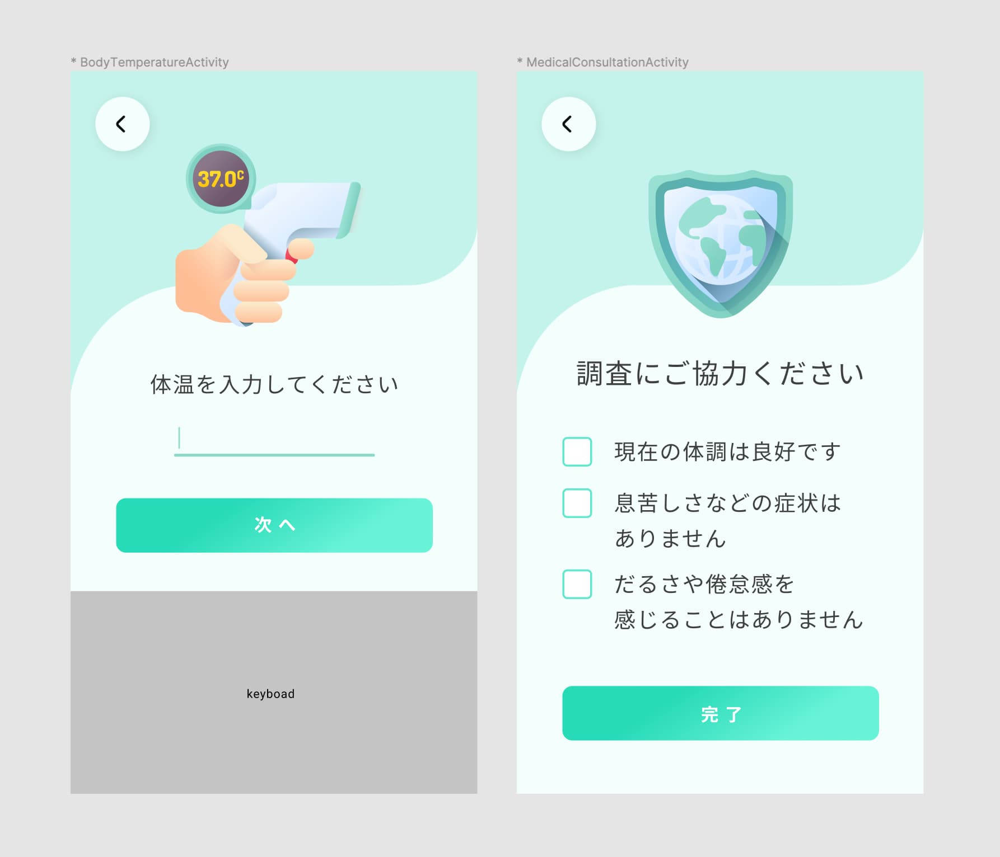

**これが岡大理事の耳に入ったらしく、コロナ対策のため、全学向けにアプリを作ることになりました!!**

具体的には、部活棟を中心に各部屋に1台 Android 端末を設置し、そこに学生証をかざすことで入退室を管理します。
感染者が出た場合は、学務課がその学籍番号を入力することで、2週間以内に同じ部屋にいた人を割り出すことができます。

## 仕様決め

このアプリの制作には、かなりの規模のサーバアクセスになりますし、扱うデータも膨大になるのでセキュリティの懸念もあります。そのため、**岡山大学情報統括センターと相談を重ねながら**仕様決めを行いました。

【機能】
- 各部屋にある端末で入室処理と退室処理を行える。
- 学務課からは、「各部屋に誰が何人いるか」「各部屋の密度」を一覧で見れるページ（Webサイト）を用意。指定日の各部屋の入退室状況を Excel でダウンロードすることも可能。
- 学務課の権限のアカウントのみ、発症者の学籍番号を入力すると、過去2週間以内に「その人が会った人一覧」と「会った部屋」を出力することができる。また、2次的に接触した疑いのある生徒も同様に出力できる。

【特徴】
- セキュリティのため、全て学籍番号で管理する。氏名や所属部活等の情報は一切保管せず、全てランダムな識別子を用いて管理。
- NFC対応端末を使用することで、学生証をスマホにかざし、入退室登録を行う。
- APIにアクセスするための権限を2つ作成する。
    - 各部屋用: この権限のない端末からの、データ送信は不可
    - 学務課用: この権限はWebへのアクセスも可能、データ管理や追跡も行える。

また、このいずれかのID・パスワードが流出した場合でも、こちらで無効化することができ、再発行可能である。

【仕様】
- A の部屋に行ったあと、A の部屋で退室せずに B の部屋の入室リクエストを行った場合は、A の部屋から退室しますというモーダルと共に、B の部屋へ入室を行う。
- 退室処理を忘れた場合は、22時に自動的に退室扱いとなる。

## 統括センターの認可が降りたのでアプリを作る！

制作期間は約3週間、AppStore と GooglePlayStore での審査期間も考慮して、実質2週間程度。
フロント（アプリ）の開発に時間がかかりそうだと思ったので、FeliCa スキャンが実装できるか心配でしたが、iOS・Android のアプリをいっぺんに作成したかったため **Flutter** を採用することにしました。Flutter にも NFC を読み取るライブラリは幾つかあるようです。

バックエンドは、とりあえず今回は Web で見れる機能も必要だったので、**Laravel** を採用しました。アプリとの通信の認証は、**Laravel Passport** を使用しています。フロントでは Blade ではなく主に **Vue.js** を使用し、コンソール画面のリロードを少なくしました。

## まずは学生証の仕様を分析する

まずは、FeliCa カードの仕様を理解するために、[SONY が公開しているドキュメント](https://www.sony.co.jp/Products/felica/business/tech-support)を読んでみることにしました。

まず FeliCa リーダは Polling コマンドで、FeliCa カードを特定します。その際、Polling コマンドのパラメータにシステムコードを指定し、システムコードが一致するカードが Polling レスポンスを返します。

一般的な学生証には、システムコードは [0xFE, 0x00] が使われているという情報があったので、試してみると岡山大学学生証もサービスコードは同じでした。

さらに FeliCa カードには、サービスコードというものがあります。
サービスとは、ファイルシステム上のブロックをグループ化したものであり、ブロックにアクセスする際に 2バイトのサービスコードが必要となります。
また、1つのブロックには16バイトの情報が格納でき、16バイトを越える場合には次のブロックに分割されます。

ここまでざっくりと学習したあと、学生証のどこに学籍番号が保存されているか分からなかったので、プログラムで総当たりしてみました！

## サービスコード 0x434B に怪しげな8バイトの数字が...

私の学籍番号が、仮に「12345678」だとすると、データ内には「1, 2, 3, 4, 5, 6, 7, 8」か、数字はASCIIやSHIFT-JISでも同じなので「49, 50, 51, 52, 53, 54, 55, 56」あたりが格納されていると予測していました。

そして、システムコード [0x43, 0x4B] に該当の「49, 50, 51, 52, 53, 54, 55, 56」を発見しました。

さらに、氏名「（例）ｵｶﾀﾞｲ ﾀﾛｳ」の半角カナのShift-JIS、「181, 182, 192, 222, 178, 32, 192, 219, 179」のデータもその次のブロックに見つかりました。

|  00  |  01  |  02  |  03  |  04  |  05  |  06  |  07  |  08  |  09  |  0a  |  0b  |  0c  |  0d  |  0e  |  0f  |
| ---- | ---- | ---- | ---- | ---- | ---- | ---- | ---- | ---- | ---- | ---- | ---- | ---- | ---- | ---- | ---- |
| ---  | ---  | ---  | ---  | ---  | ---  | ---  | ---  | ---  | ---  | ---  | ---  | ---  | ---  | ---  | ---  |
|  48  |  49  |**49**|**50**|**51**|**52**|**53**|**54**|**55**|**56**|  00  |  00  |  00  |  00  |  48  |  49  |
|**181**|**182**|**192**|**222**|**178**|**32**|**192**|**219**|**179**|  00  |  00  |  00  |  00  |  00  |  00  |  00  |
|  ..  |  ..  |  ..  |  ..  |  ..  |  ..  |  ..  |  ..  |  ..  |  ..  |  ..  |  ..  |  ..  |  ..  |  ..  |  ..  |

各値の前には「48, 49」（=01）という値がついていたのですが、何を表しているのかはよくわかりませんでした。

今回は学生番号8桁のみ取得します。

## よし、まずはフロントから完成だ！

案の定、デザイン作りから始めます。
まぁシンプルですが、リリース後にデザインはいくらでも変えれますし。。

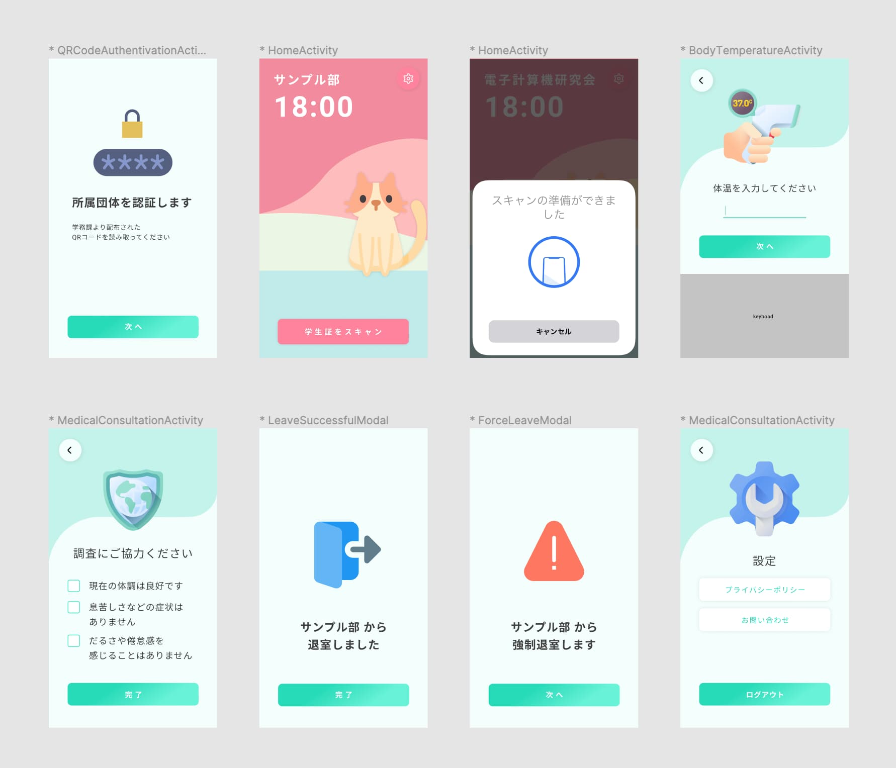

iOS での FeliCa スキャン（Flutter）に関する文献が一切なく、パッケージのドキュメントにもリクエスト手順が記載されてなかったため、かなり苦戦しました...

## 動作デモ

まずアプリの認証には、各部屋ごとに発行された QR コードを使用します。
この QR コードは、学務課が Web から発行することができます。

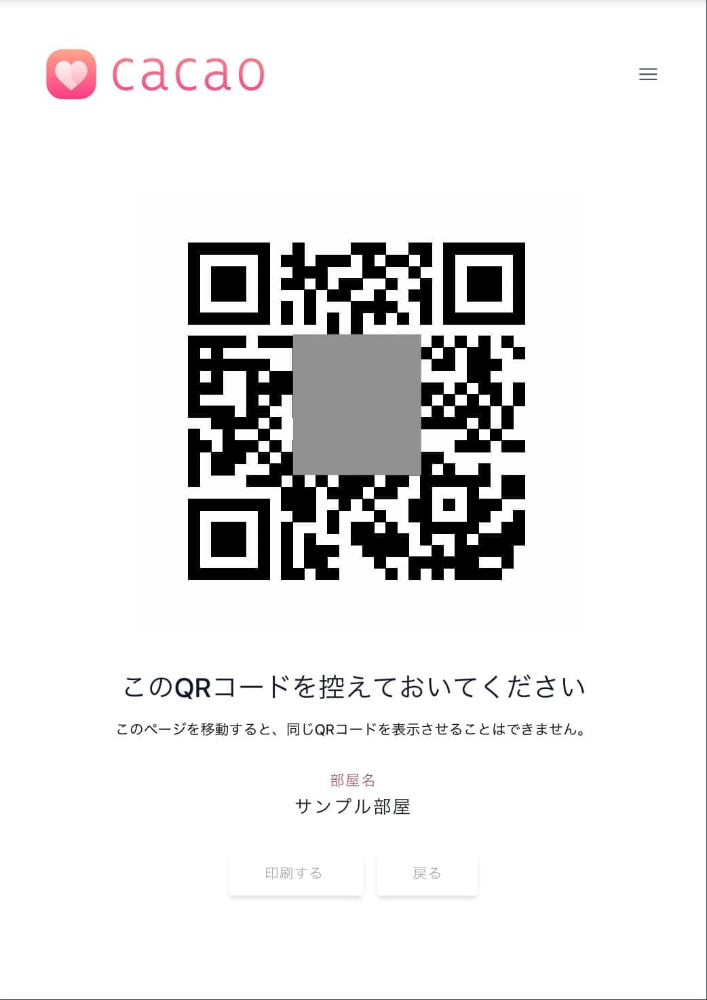

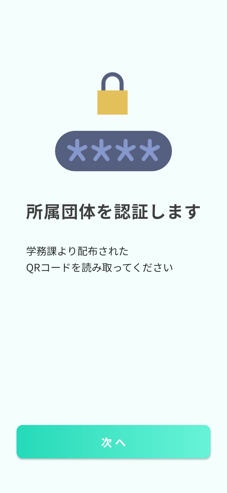
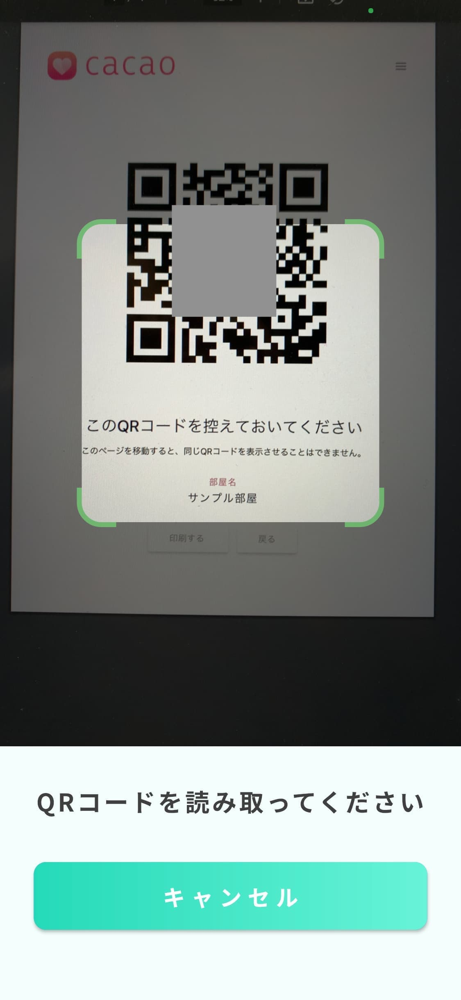

また、初期バージョンの動作については以下の通りです。



## アプリ審査

アプリ審査では、案の定 AppStore が一番苦戦しました。
今回勉強になったのが、**コロナ関係のアプリは個人 Developer ではリリースできない**ということです。
なので、入退室管理アプリとしてリリースすることにしました。
また、ユーザのヘルスチェックを行う（今回体調に関する質問の画面がありました）場合は、**収集するデータや医学的決定を下す際の根拠等を明白にする必要がある**らしく、今回は医学的決定を下さないため免除となりましたが、体温入力画面に「入力されたデータについて」という、ガイドラインを表示するボタンを設置することになりました。

また、岡山大学との連携とのことで審査で根掘り葉掘り聞かれたり、デバッグに岡山大学学生証が必要なため、デバッグテストやデモ映像等の提出を複数回重ね、結局は1週間近くかかってしまいました。

なお、Google Play Store は、アプリを起動するとクラッシュして落ちるというバグを含みながらも、ストアに通っていたので、逆に不安になりました。。（アプリ署名を develop 用で署名したので提出してたっぽい？）`signingConfigs` を `release` に変更し、release 用のデータで署名することで直りました。

## 追跡用の Web ページも少し紹介

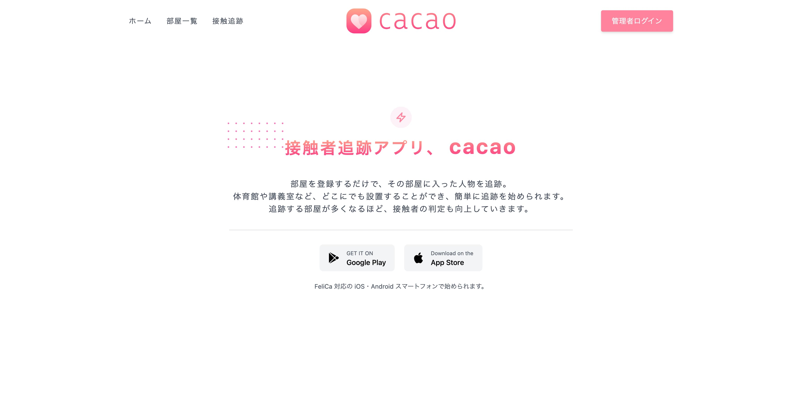

学務課がログインすることにより、さまざまな情報を閲覧することができます。

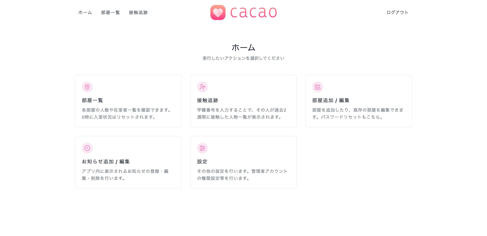

また接触追跡では、感染者の学籍番号を入力することで、その人が過去2週間以内に会った人、その部屋一覧を表示できます。データは Excel 形式でダウンロードすることもできます。目安として、15分以内は濃厚接触には当たらないので、そのステータスも表示させています。

下記の写真はテストデータで、632人もの検出を行っていますが、クエリ数を少なくすることで高速に追跡を行えるよう工夫しました。

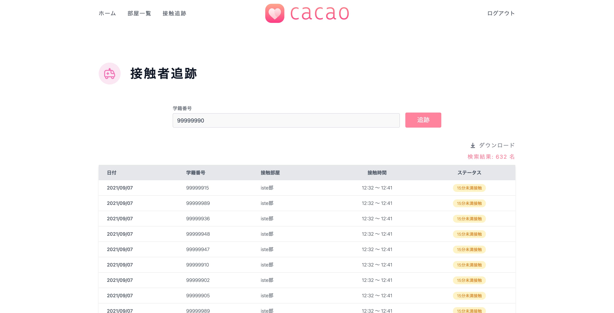

他にも、どの部屋に何人くらいいるのかを表示させたり、アプリ向けのお知らせもこのサイトから登録できます。

## アプリ名の決定

最後に、このアプリの名前とアイコンを決めました。

コロナの接触追跡アプリとして、日本が提供している「COCOA」というものがあります。
その名前に~~対抗して~~インスパイアされて、「cacao」という名前にしました。

驚いたのが、**AppStore で「cacao」という5文字の表示名が取られてなかった**ことです。
例えば以前リリースした音ゲーアプリ「vivace」は同じ名前のアプリがあったため、副題をつけて「VIVACE ~オープンソースの音ゲー~」としました。よく考えれば、カカオトークも「kakao」ですし、とてもラッキーですね！

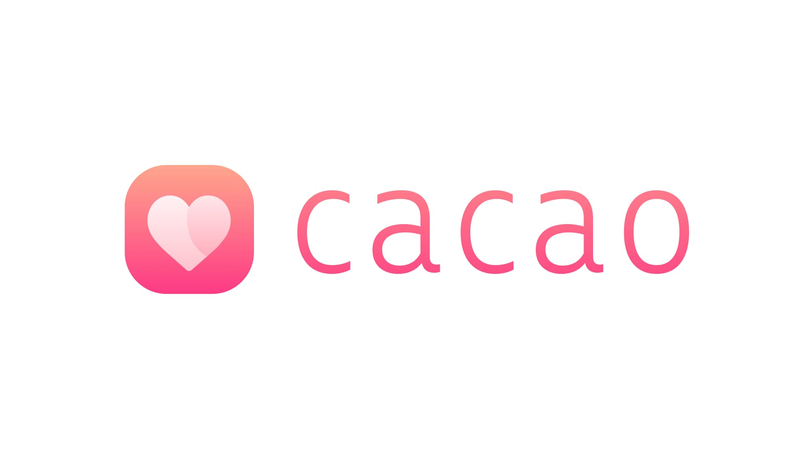

アプリアイコンについては、出会い系アプリっぽいと同級生に揶揄されています()

私は気に入っているのでよし (笑)

## 無事ストアで公開しています

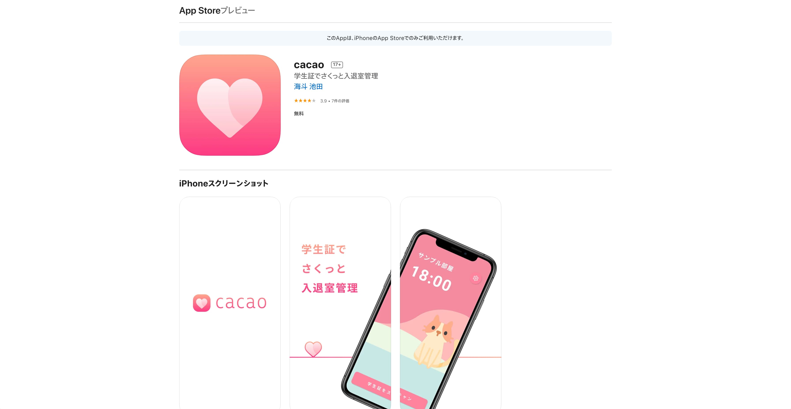

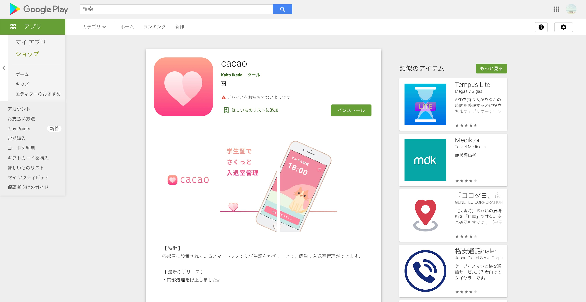

今回、スマートフォンアプリについての大規模なサービスを始めるのは初めてだったので、とても良い経験・勉強になりました。

学生支援課とも相談しつつ、慎重にアップデートを重ねていきますので、本アプリをどうぞよろしくお願いします。