## はじめに

私がよく参考にさせて頂いているデザインサイト・フリーアイコンサイトをまとめてみました！

## デザイン編

### [Dribbble](https://dribbble.com/)

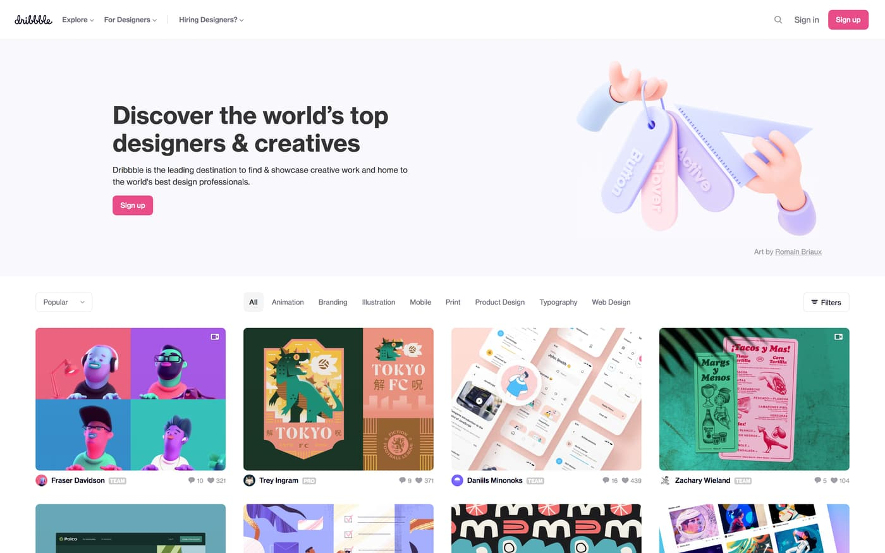

- 全て閲覧するにはアカウントが必要
- アニメーションやプロダクトデザインなども掲載されているのが面白いところ
- Adobe Xd や Figma などのツール向けにダウンロードできるのが素晴らしい

### [UI Garage](https://uigarage.net/)

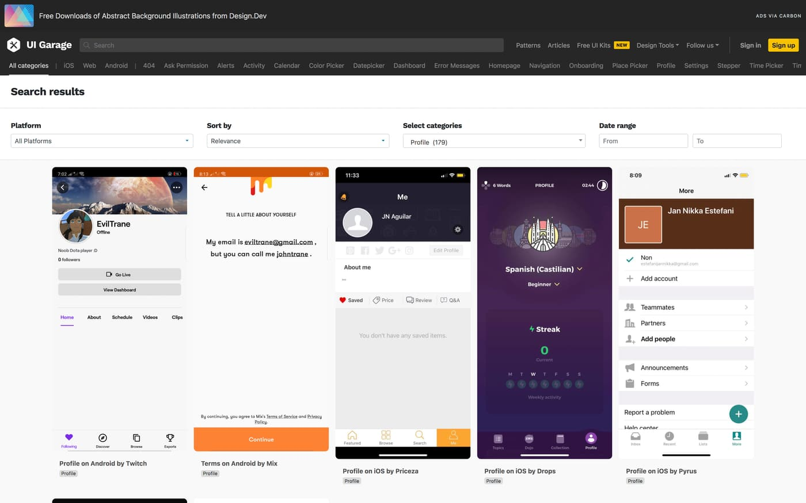

- iOS・Web・Androidとジャンル分けされており、すぐに目的のデザインにたどり着ける
- このサイトは細かいジャンル分けがされており、「404ページ」・「ダッシュボード」・「設定画面」など90種類以上の項目があり、参考にしたいパーツのデザインにどっぷりと浸かれる
- 記事ページでは、いろいろなサービスのデザイン考察や設計に役立つTipsを載せていて，暇な時間に軽く読める

### [Material Design](https://material.io/)

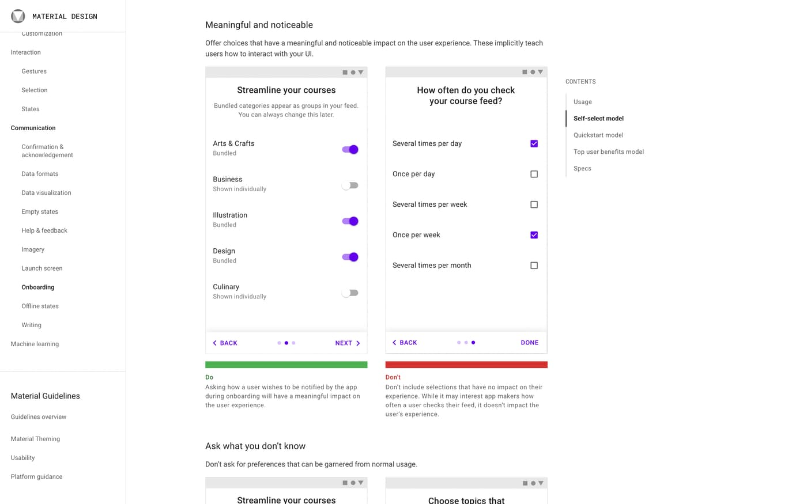

- Googleさんが2014年にデザインガイドラインとして定めた、例の "Material Design"
- 視覚的に良いデザイン・悪いデザインを学習できるのは有名だが、動きや起動画面・テキストの表示方法などの細かいUI・UXも学習できる点に価値あり
- アイコンやテーマもダウンロードできる

### [動くWebデザインアイディア帳](https://coco-factory.jp/ugokuweb/)

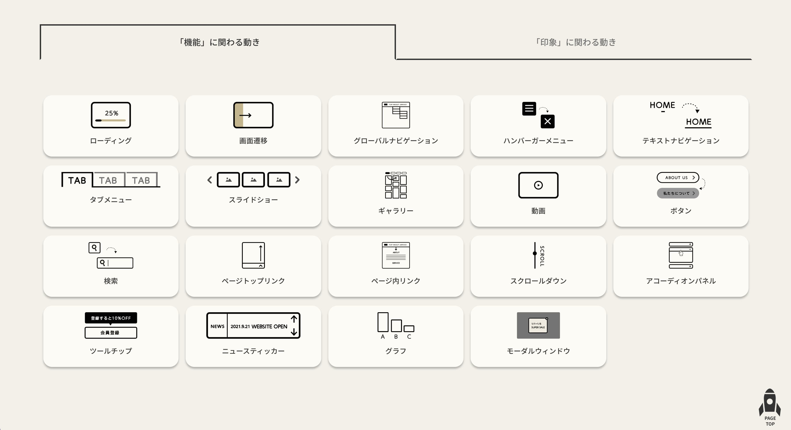

- ティザーサイトを制作する際にかなり重宝！！かなりかっこいい
- 1つの機能（例: ローディング）にもさまざまな配置パターンが用意されており、コードを書く作業がかなり減る
- jQueryを使用するものが多いので、脱jQueryを目指している方には大変かも...

# アイコン編
お気に入りのアイコンを一言で紹介

### [Feather](https://feathericons.com/)

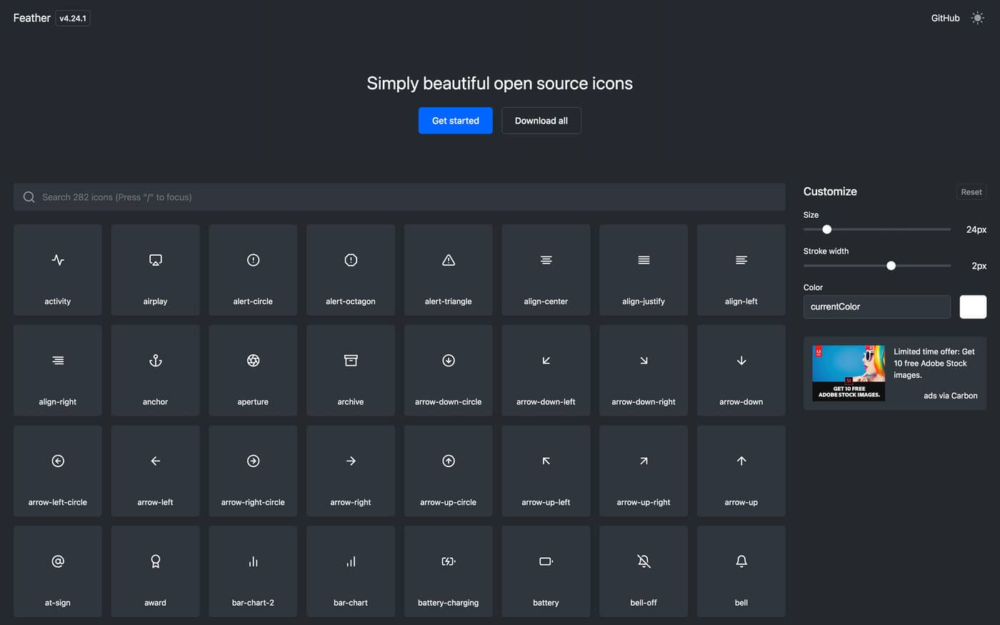

- 角が取れた優しいストロークアイコン
- アイコン数は若干少なめだが、アイコンが統一しているのでナビゲーションバーなどに使いやすい

### [icons8](https://icons8.jp/)

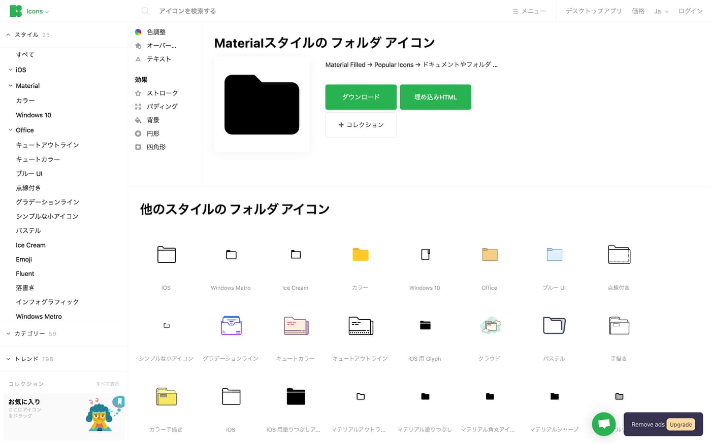

- 1つの画像に様々な画風のアイコンがたくさんあるため、このWebページを訪れれば欲しいタイプの画像が見つかる
- 私は 「iOS」 風が好き

### [JAM](https://jam-icons.com/)

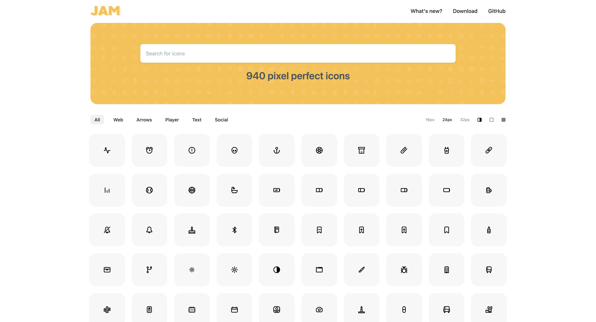

- こちらも丸みを帯びたストロークアイコン
- 先程の Feather と比べ、アイコン数が結構多いのでよく使っている

### [Uicons](https://www.flaticon.com/uicons/interface-icons/)

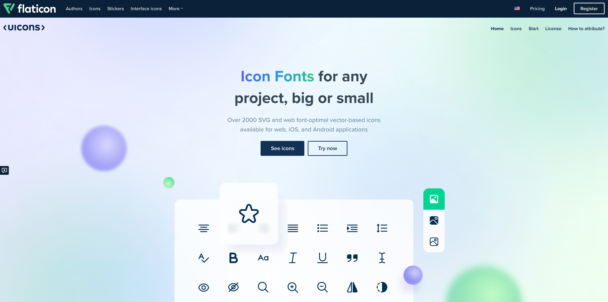

- flaticon の会社がやっている、Font Awesome のようなもの
- アイコンがかなり可愛いのでよく使っている
- ストロークアイコン以外にも、塗りつぶしアイコンにできたり線の角を角ばらせることもでき、拡張性は高い

### [SVG Repo](https://www.svgrepo.com/)

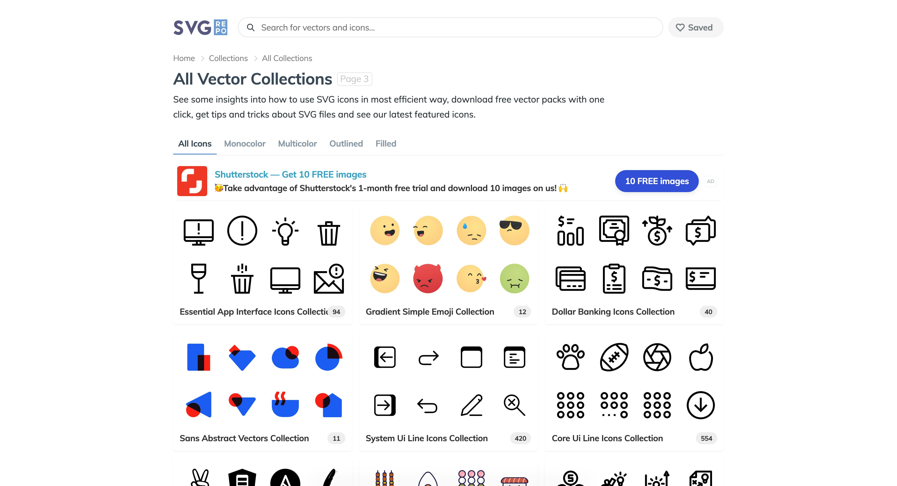

- "Collection"という単位があり、その Collection 内にあるアイコン（画像）はテーマが統一されており、同じ画面に複数のアイコンを使う際に見栄えが良い
- この "Collecton" がたくさん用意されており（現時点で450+セットある）、フラットな天気アイコンや丸みを帯びた日本食アイコンなど、眺めるだけで楽しい

### [Font Awesome](https://fontawesome.com/)

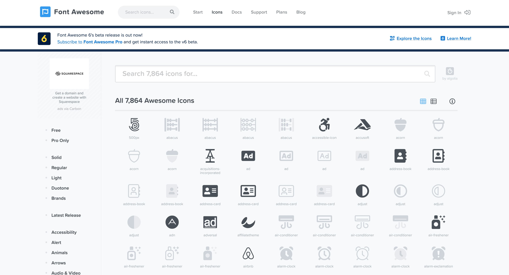

- 認知度は一番高いと思うが、一応入れておく
- CDNやnpmなどから入れることができ、導入がかなり楽
- アイコン数もずば抜けて多い

### [unDraw](https://undraw.co/illustrations)

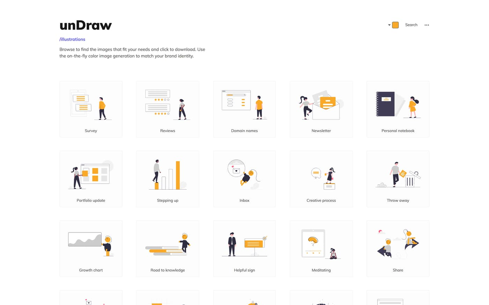

- 海外のデザイナーたちがよく使ってるフラットアイコン

### [stories](https://stories.freepik.com/rafiki)

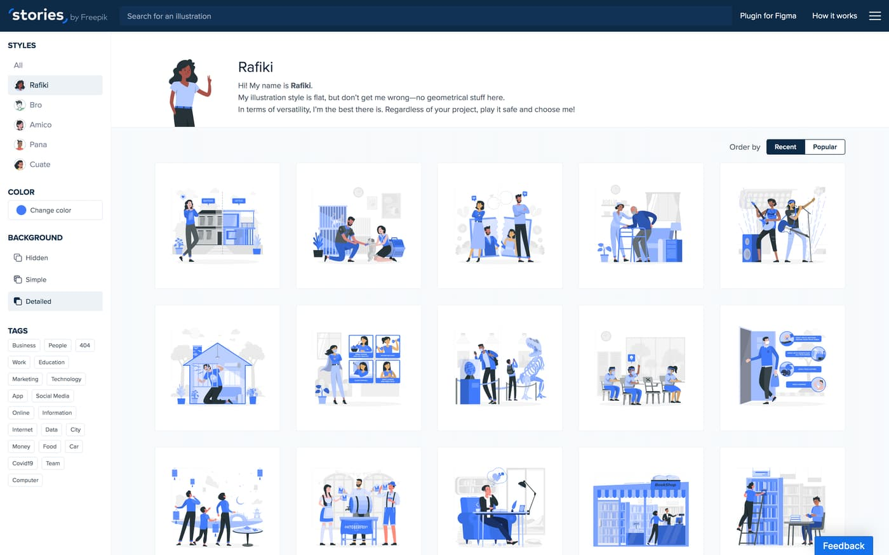

- 同じくフラットアイコン

## この記事は、私の Qiita からの転用です

> [**デザインする際に参考にしているサイトまとめ**](https://qiita.com/smpny7/items/d581820af4728aeb07d4)　https://qiita.com/smpny7/items/d581820af4728aeb07d4
