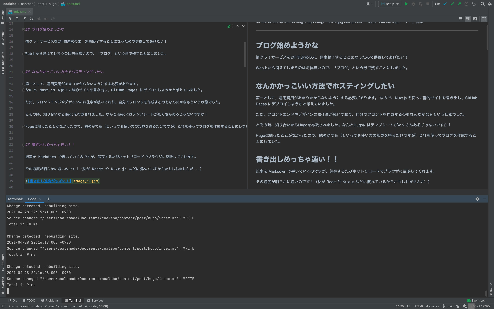
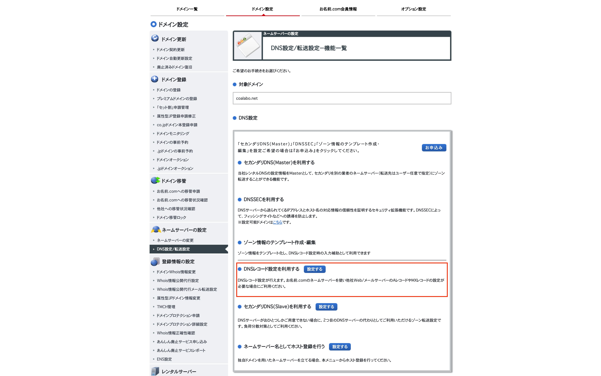
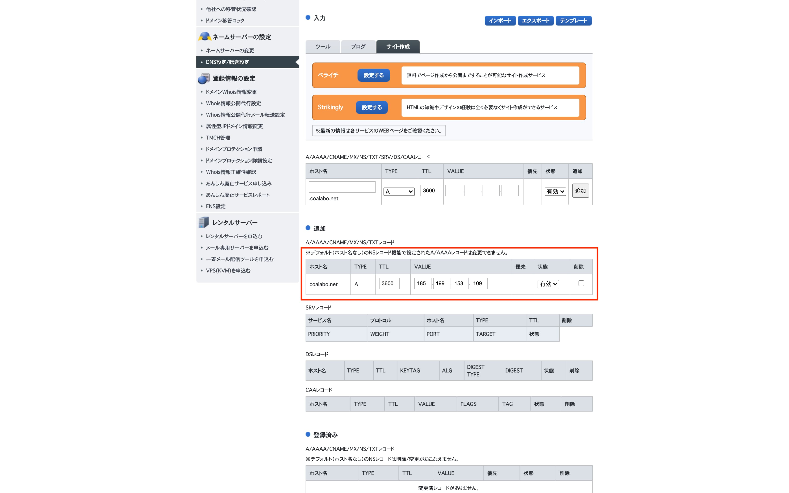
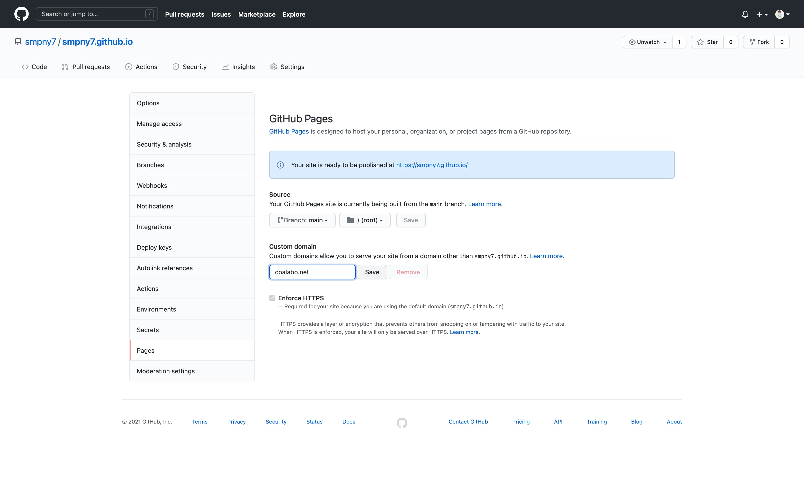
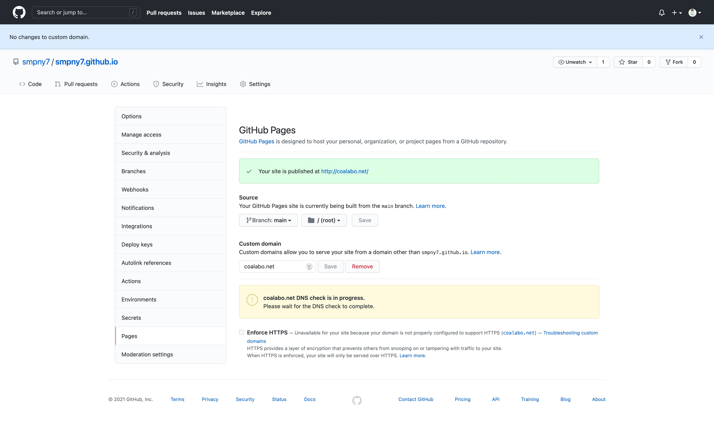

## ブログを始めてみたい！

ブログを始めたいと思ったきっかけは、自分が作ったサービスが終了してしまうことでした。

せっかく作ったものが消えて日の目を浴びなくなるのは勿体ないので、
ブログという形で供養してやります！


## なんかかっこいい方法でホスティングしたい

第一として、運用費用があまりかからないようにする必要があります。
なので、Nuxt.js を使って静的サイトを書き出し、GitHub Pages にデプロイしようかと考えていました。

ただ、フロントエンドやデザインのお仕事が続いており、自分でフロントを作成するのもなんだかなぁという状態でした。

とその時、知り合いからHugoを布教されました。なんとHugoにはテンプレートがたくさんあるじゃないですか！

Hugoは触ったことがなかったので、勉強がてら（といっても使い方の知見を得るだけですが）これを使ってブログを作成することにしました。


## 書き出しめっちゃ速い！！

記事を Markdown で書いていくのですが、保存するたびホットリロードでブラウザに反映してくれます。

その速度が明らかに速いのです！（私が React や Nuxt.js などに慣れているからかもしれませんが...）



Terminal 上に表示されている再レンダリング時間は `9ms` とでていますね。

もう、一目惚れしました。


## GitHub Pages にデプロイしよう

すいません、タイトル詐欺です。
デプロイする前に1つすることがありました。

今回 [Hugo Theme Stack](https://themes.gohugo.io/hugo-theme-stack)というテーマパックを編集して使ったのですが、
これを submodule 登録しておきます。

```shell
$ git submodule add https://github.com/CaiJimmy/hugo-theme-stack themes/hugo-theme-stack
```

また、git から clone する時は、submodule も忘れず引っ張ってくるようにしましょう。

```shell
$ git clone --recurse-submodules --depth 1 git@github.com:smpny7/coalabo.git
```


## GitHub Actions で自動化しよう

今度こそ、GitHub Actions で GitHub Pages に自動デプロイするように設定していきます。

今回 GitHub Pages 用に、`<GitHub ユーザー名>.github.io` のリポジトリを作成しました。
なぜそうしたかというと、`https://<GitHub ユーザー名>.github.io` でそのサイトが閲覧できるようになるからです。

ドメイン後にパスが続かないのは、カスタムドメインを設定する際に大切です。

GitHub Actions には [GitHub Pages action](https://github.com/marketplace/actions/github-pages-action#getting-started) というのが
マーケットプレイスに公開されていたので、これを参考に作成しました。

```yaml
name: github pages

on:
  push:
    branches:
      - main  # Set a branch name to trigger deployment

jobs:
  deploy:
    runs-on: ubuntu-18.04
    steps:
      - uses: actions/checkout@v2
        with:
          submodules: true  # Fetch Hugo themes (true OR recursive)
          fetch-depth: 0    # Fetch all history for .GitInfo and .Lastmod

      - name: Setup Hugo
        uses: peaceiris/actions-hugo@v2
        with:
          hugo-version: '0.78.2'

      - name: Build
        run: hugo --minify

      #   - name: Deploy
      #     uses: peaceiris/actions-gh-pages@v3
      #     with:
      #       github_token: ${{ secrets.GITHUB_TOKEN }}
      #       publish_dir: ./public
      - name: Deploy
        uses: peaceiris/actions-gh-pages@v3
        with:
          deploy_key: ${{ secrets.ACTIONS_DEPLOY_KEY }}
          external_repository: smpny7/smpny7.github.io
          publish_branch: main
          cname: coalabo.net
```

submodule を一緒に引っ張ってくるのも、忘れないように設定しましょう。

そして GitHub の Secrets に、`ACTIONS_DEPLOY_KEY` という名前で SSH のプライベートキーを設定しておきます。


## ドメインが 35円だと！？

本当にたまたまです。`.com` ドメインや `.net` ドメインが 35円セールしてました。


ドメイン移管が安くなるのはしょっちゅう見てましたが、ドメイン自体が安くなっているのを見たのは初めてでした！

サイト名に迷走して、3つくらいドメインをとってしまったのは秘密です。


## 取得したドメイン名に設定しよう

お名前.com の管理画面に行き、`DNS 設定 > DNSレコード設定を利用する` を選択します。



Aレコードに、GitHub Pages のアドレスを入力します。



本来は、CNAMEレコードに `github.io` のドメインを登録するのが良いのですが、
私の場合うまく動かなかったので Aレコードで登録しました。

GitHub Pages の仕様変更によって、グローバルIPアドレスが変わる恐れもあるので、その辺りは今後の検討課題です。


## Google Search Console を登録する

Google Search Console とは、検索順位やサイト内のエラーを取得してくれる Google のサービスです。
通称 Googleサチコです。

今回登録するにあたり、サイト所有確認なのですが、ドメイン認証にしようと思っているのでここで設定してしまいましょう。

先程のレコード登録画面で、レコードを `TXT`に、`VALUE`をサチコで表示されたコードに設定します。

> 諸説ありますが、最後の「転送用のネームサーバーに変更する」は一応チェックを外しておきましょう。


## GitHub Actions を設定

構築も終盤にさしかかってきました。

GitHub Pages 設定の `Custom domain` 項目に、使用したいドメインを入力します。



Save を押すと、ドメインが `github.io` に転送されるかのチェックが行われます。



確認されたら `Enforce HTTPS` が選択できるようになるので、チェックを入れておきましょう。


## でたな gtag.js（定期）

Google Analytics が最近変更になったらしく、昔は `UA-XXXXXX-X` というタグだったのですが、
今は Gタグと呼ばれる `G-XXXXXXX` というものに変更されています。

これに伴い、JavaScript 部分も変更になるので、使用していたテーマパックの Google Analytics が正常に動きませんでした。

私の使用しているテーマパックでは以下のように対応しました。

1. `layouts > partials > head > custom.html` というファイルを作成すると、そこに記述されたコードがサイトの `head` に挿入されることがわかった。
2. カスタムテーマにしたかったので、`custom.html` から `style用ファイル` と `analytics用 JSファイル` を読み込みようにした。

`style用ファイル` には自分がカスタムした部分のCSSを、
`analytics用 JSファイル`には例の Google Analytics 用コード9行が書かれています。

また、customファイルは以下の通りです。

```html
<!-- Custom Style -->
{{ partial "style/custom" . }}

<!-- Analytics -->
{{ if not .Site.IsServer }}
    {{ partial "google/analytics" . }}
{{ end }}
```

↑ デバッグでは Google Analytics がうごかないようにしています


## さいごに

カスタマイズしたサイトは以下のようになりました！


自分があまりチャレンジしたことのない配色でデザインしてみたのですが、
結構きれいにまとまってて気に入ってます！

データの蓄積された Google Analytics をみるのが楽しみです。
