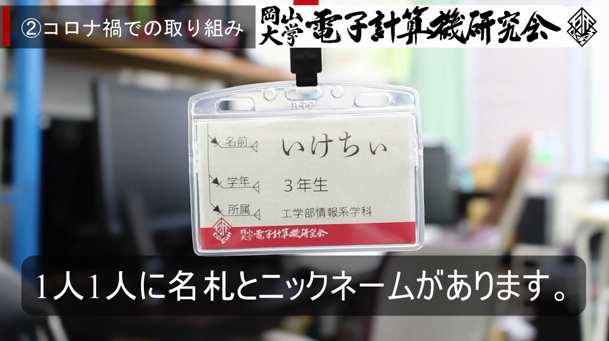
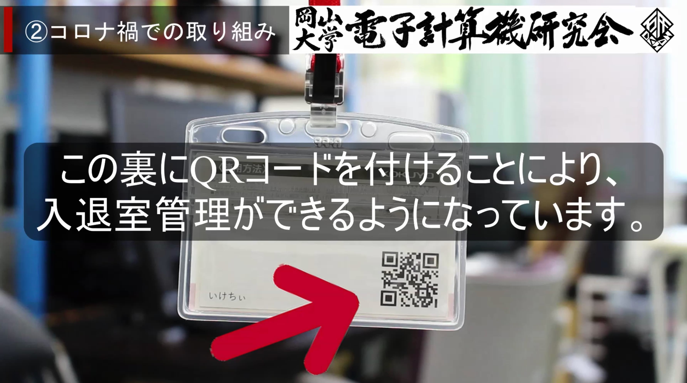
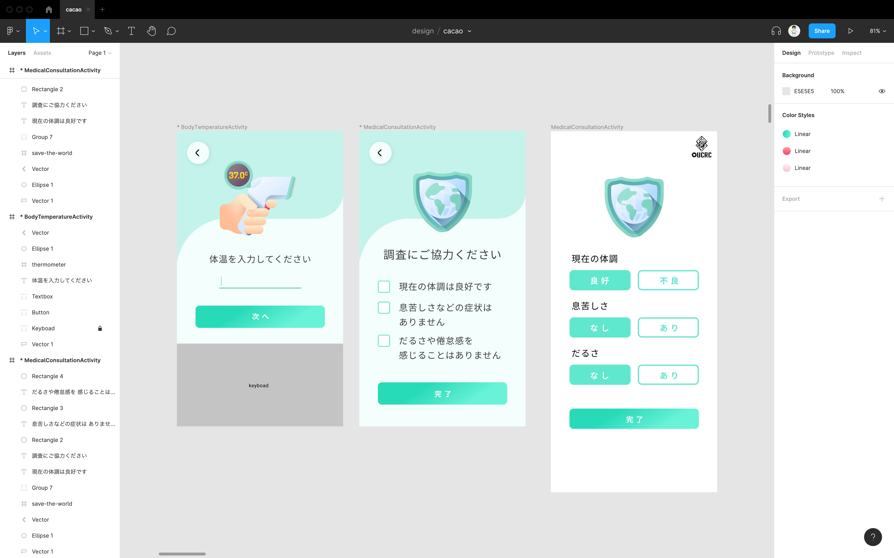

## 昔々、大学で対面授業が再開し始めた頃...

2020年夏頃、活動時の体温記録を条件に、岡山大学での部活動が再開されました。

私は [岡山大学電子計算機研究会](https://oucrc.net/) という部活の部長を務めているのですが、
活動の際には、全員の「体温・息苦しさなどの症状があるか・だるさや倦怠感を感じるか・入室時刻・退室時刻」を記録するよう指示がありました。

最初の1週間は Google スプレッドシートを共有して、部室に来た部員に手入力してもらってたのですが、
特に `帰る時にパソコン（スマホ）を開いて現在時刻を入力する` のがとても面倒...

どうにかできないかと考え、**課題を感じた時に技術で解決するのがエンジニアでしょ！** ということで、部室に設置するアプリを制作することになりました。

## その前に

この部活では、部員全員にニックネームがついています。
これは、先輩後輩関係なく気軽に呼び合い、技術の共有などコミュニケーションを円滑にするためです。

そして、部屋の入り口にかけてある自分のネームプレートを、入室時には首にかけることになっています。

その後ろに、今回小さなQRコードをしのばせました！

QRコードの中身のデータは、部内でユニークなuuidを発行しています。

## 作りたいもの

入退室管理アプリをつくり、部室の入り口に設置します。
必要な機能は以下の通りです。

- 入室時刻が記録できる
- 入室時の体温を記録できる
- 入室時の健康状況をチェックできる
- 退室時刻が記録できる

そして、一番大事なことは、**できるだけ入力の手間を最小限にすること** です。
何回もボタンをぽちぽちするようなUI・UXでは、そのうち面倒になって誰も入力してくれません!
できるだけ画面数を少なくし、アニメーションたっぷりで気持ち良いアプリに仕上げることで入力してくれる人が増えると考えました。

## さぁ一番大好きなデザイン（UI設計）の時間です！

~~ま、まぁもちろん一番好きなのはコーディングですよ...？~~

どういうものを作ろうかと構想する、良いアイデアを思いついてアプリに組み込んでいく時間が、一番ワクワクして楽しいですよね。

今回も Figma で、ある程度のデザインを仕上げました。

左2枚のスクリーンが実際に使用した画面です。

体調チェックについては、最初は一番右のデザインでしたが、入力者が「良好」・「不調」や「なし」・「あり」等のボタン内の文字を読む時間（コスト）がかかってしまい、また分かりにくいので、真ん中のデザインの直感的でわかりやすいチェックボックス式へと改良したりしています。

## 実際に制作していこう！

今回使うのはこちら↓

【 材料 】
- MacBook Pro: 一人前
- herokuサーバ（Heroku Postgres をトッピング）: 一台
- 部内設置端末（Android）: お好みで

【 調味料 】
- Kotlin（フロント）
- Node.js + TypeScript + Express（バックエンド）
- Docker （herokuにしたので使わなくなった）

完成品は [こちら](#github-リポジトリ) に用意してあります！

## 工夫した点

今回、本番環境での安定した・長期的な保守ができるように意識して制作しました。
まぁコロナが終われば使うことは無くなるのですが、勉強も兼ねて結構丁寧に作成しました。（卒業時にコロナ禍が収束していなければ、後輩にソースコードを引き継ぐことになりますし...）

例えば、ルーティングをバージョンごとに `app.ts` で切り分けて、バックエンドのAPIバージョンアップしても管理しやすいようにまとめていたり、PostgreSQLのデータベースも、きちんとマイグレーションファイルを作成して、DBの追加・修正を行いやすいようにしています。

herokuを使うということで、今回初めてPostgreSQLを触ったのですが、Connection Pool でだいぶ苦労しました...
接続を切るところをクエリ発行の直後にしないといけなく（ライブラリのせいかもしれないです？）、Connection が閉じられていないままになっており、謎のタイミングでサーバが落ちたりしていました。

粘り強く原因を探して、なんとか解決しました...（後日まとめようと思います）

## 最初の1週間はGASをバックエンドにしてました

最初はGoogle スプレッドシートと連携して、バックエンドのAPIにして、アプリでの入力データを格納していました。
しかし、GASのAPIはレスポンスに5秒くらいかかるんですよね...

最初に掲げた通り、ストレスなく入力できるアプリを目標としていたので、通信のくるくるが5秒続くようではストレスフリーとは言えません。そのため、heroku サーバをバックエンドにして作り直しました！

## 動作映像

今回、このアプリケーションを大学に発表する場があり、友人が動作映像を編集してくれました。（一部抜粋）



## おまけ機能

動画内でも紹介しているのですが、2つのおまけ機能がついています。

- Webサイトから部室内に人がいるか確認できる機能
- Slack の Bot から、部室に誰がいるか確認できる機能

1つ目の機能は、ejs でパパッとデータ取得 & 画像切り替えをしています。

表示させている画像は、部員が書いてくれました！！
この部活には公式キャラクターなるものがいて、部屋に人がいる・いないバージョンの絵を描いてくれました。
名前は「ことちゃん」です、以後よろしくお願いします(笑)

2つ目の機能は、後輩が作ってくれました！

ことちゃんが部室にいるメンバーを教えてくれます。かわいいですね！

## GitHub リポジトリ

拙いコードですが、もしこういったアプリを一時的に用意したい場合はぜひご活用ください。

> [**smpny7/i10jan-kotlin**](https://github.com/smpny7/i10jan-kotlin)　https://github.com/smpny7/i10jan-kotlin

> [**smpny7/i10jan-api**](https://github.com/smpny7/i10jan-api)　https://github.com/smpny7/i10jan-api

> [**smpny7/i10jan-gas**](https://github.com/smpny7/i10jan-gas)　https://github.com/smpny7/i10jan-gas