## だってお風呂で音楽聴きたいもん...

こちらの iPhoneXS、毎日お風呂で使ってたんですが水没しちゃいました。

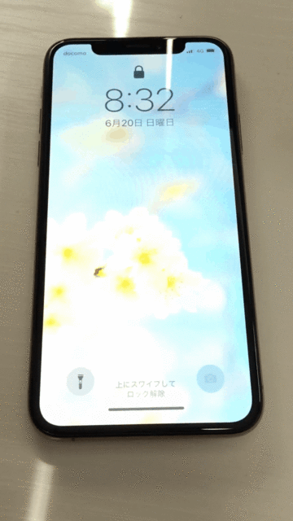

iPhoneXS は 2018 年に発売され、IEC規格60529に基づくIP68等級に適合しているそうです。
どのくらいかというと、最大水深2メートルで最大30分間使用できるらしい。。

毎日お風呂で壁に立てかけて音楽を聴いてたんですが（風呂に携帯持ち込むなと、友人にめちゃめちゃ怒られました）、突然ディスプレイがちらつき始めたのです。

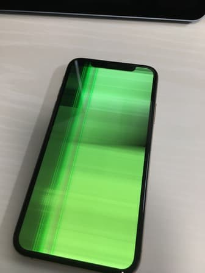

## ん、まだ息はある...？

とりあえず iPhone を完全に放置し、内部が乾燥したであろう2日後に、おそるおそる Mac に接続。

すると、なんと反応があるではないですか！もしかして壊れていたのはディスプレイだけ...？

とりあえず急いでバックアップをとり、密林に行って交換用ディスプレイを購入することにしました。

> **購入したもの**　[https://www.amazon.co.jp/gp/product/B08RYRPJGK/ref=ppx_yo_dt_b_asin_title_o06_s01](https://www.amazon.co.jp/gp/product/B08RYRPJGK/ref=ppx_yo_dt_b_asin_title_o06_s01)

## 届きました！修理開始です

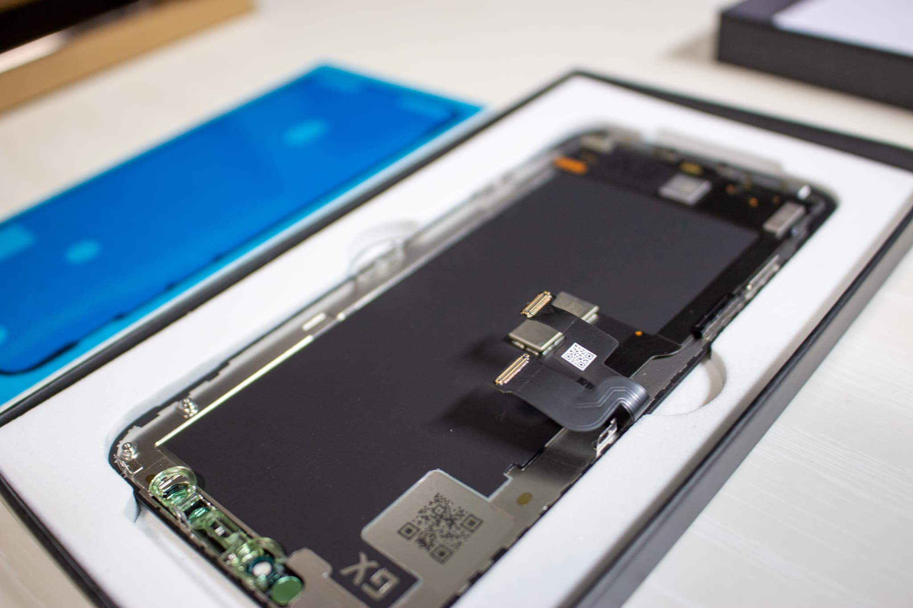

ディスプレイが届きました！めちゃめちゃ綺麗な箱に入って届いて、若干テンションが上がりました(笑)

今回のキットにはドライバー3本とピンセット、ヘラ、吸盤、開口ツールなどの工具に加え、防水フレームステッカー（大切）とおまけのガラスフィルムもついてきました。
写真はは左から順に、星型ドライバー、十字型ドライバー、Y字型ドライバーです。

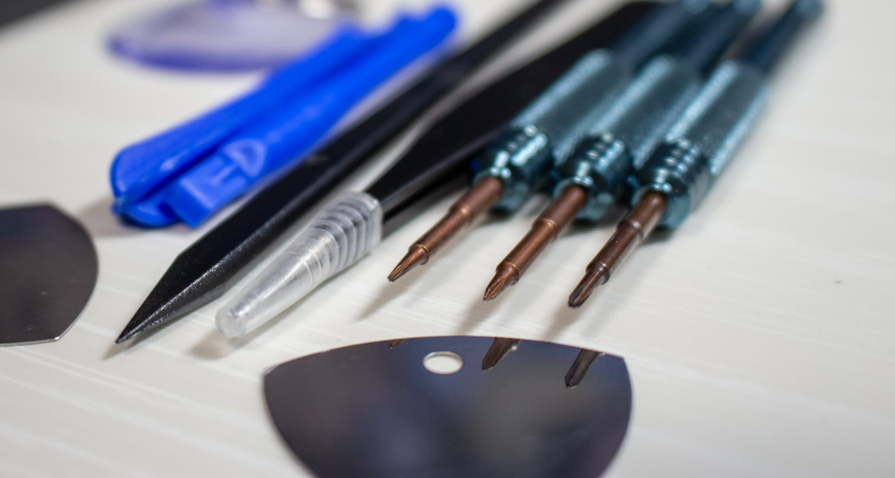

まずはおしりのネジ2つを外していきます。YouTube で分解動画などがよくありますが、皆さん簡単そうに回していますが一番ここが難しかったです。
少しでも力を抜くと、すぐにネジがなめてしまうので注意しましょう。

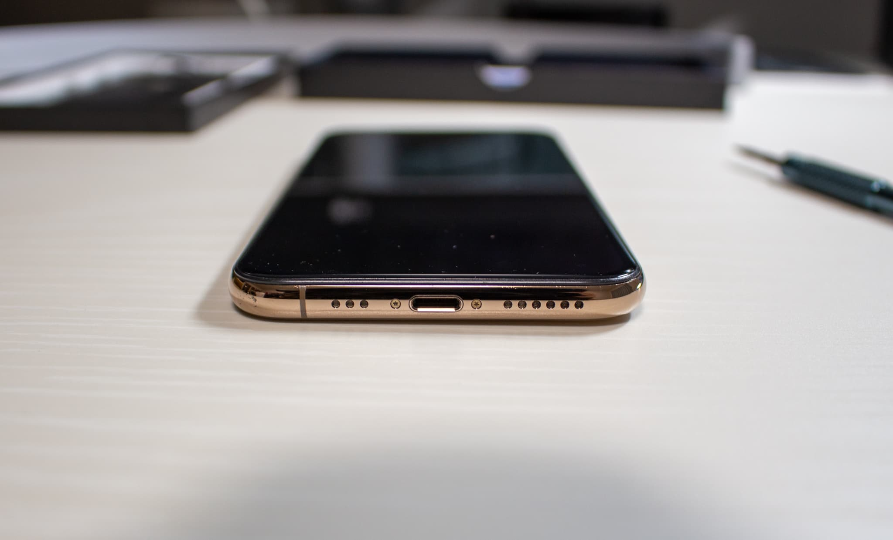

あとは大体想像つくかと思いますが、ドライヤーでシールの粘着力を弱めていきます。
そして吸盤で引っ張り、隙間を作って開いていきます。

お風呂で使っていたため、湿気などで防水フレームのシールが朽ちているかなと思っていましたが、予想通りでした。
ゴムが水分で、画像のように粉々になっていました。（あとで綺麗に除去しておきました。）
交換用の防水フレームシールが入っていてよかったです！

本体正面から見て右側にケーブルがあるので、あまり深くヘラを差し込まないようにしましょう。

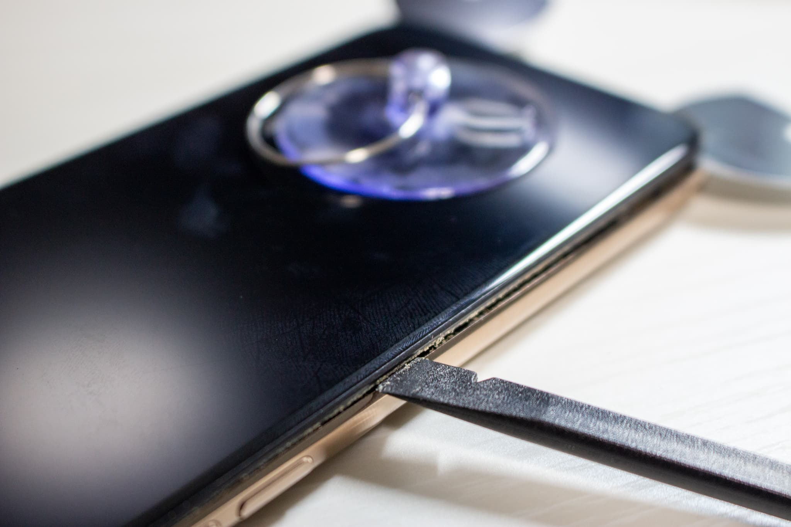

## ようやくご対面です（一苦労）

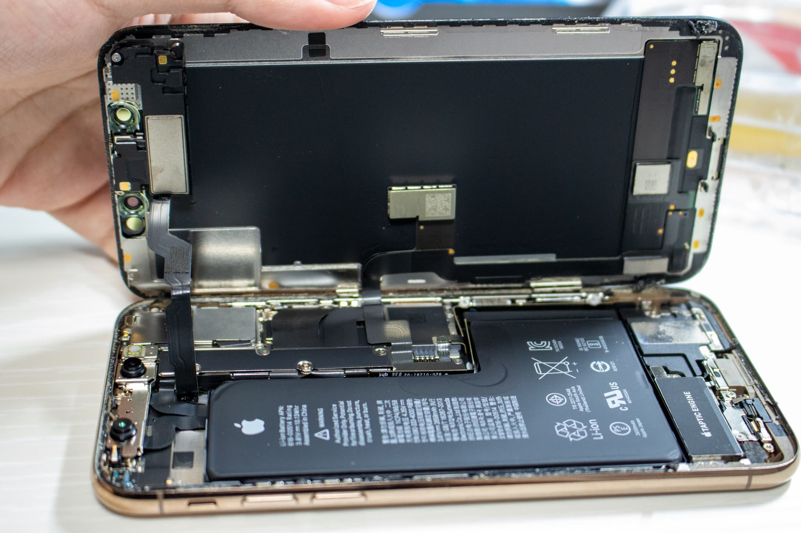

ここから、まずバッテリーに接続されているケーブルを外し、その後ディスプレイにつながるケーブル3本を外します。

ケーブルが接続されているところにはカバーがついているのですが、ここをネジで外します。
驚いたのはネジの高さ（深さ？）で、1~2mm くらいしかありませんでした。
さすが Apple 製品、コンパクトな作りです。（紛失注意）

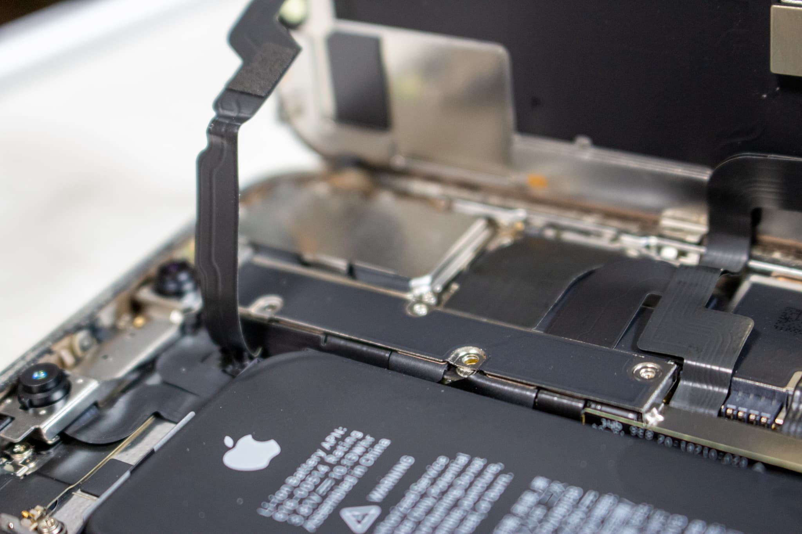

こちらがカバーを外した画像です。

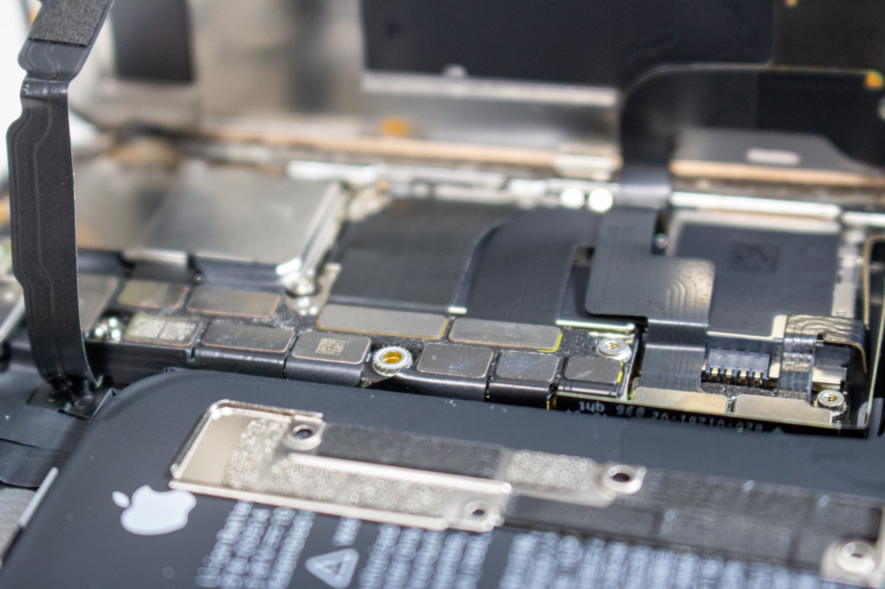

まずはバッテリーの接続をはずし、通電するといけないので端子をセロハンテープ等で巻いておきます。

そして、てこの原理をつかってディスプレイのケーブルコネクタを解除します。

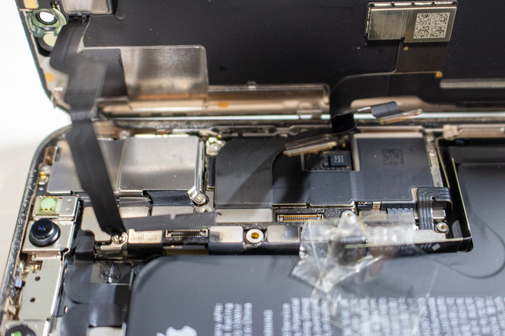

これで iPhone の 2枚おろしの完成です！

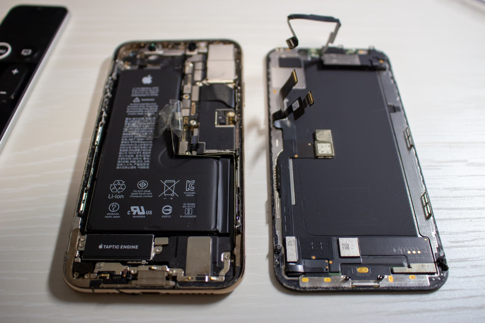

## 新しいディスプレイに FaceID 部分を移植します

ここが一番緊張しました。

上部のカメラ部分を新しいディスプレイに移すのですが、あまりネジで強く締めすぎるとディスプレイが割れてしまうので、慎重に作業を行います。

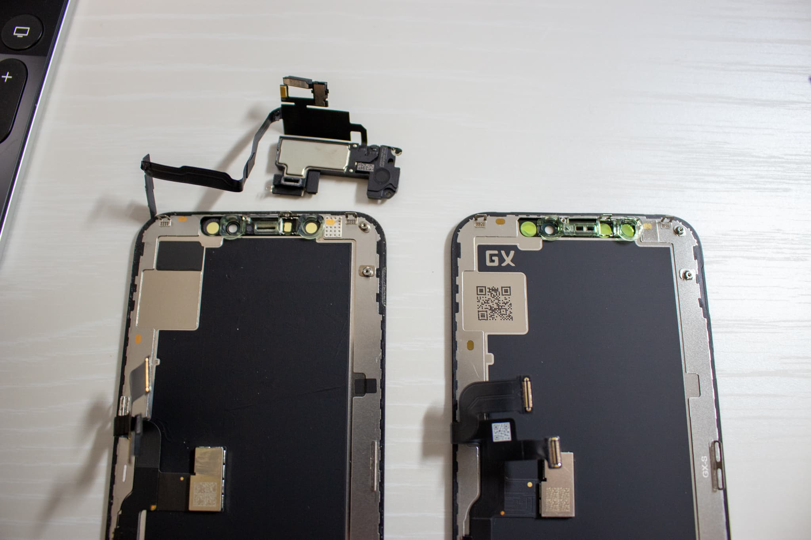

## あとは逆の手順でもとに戻していきます

組み立ては端子を挿すだけでいいので、簡単でした。

蓋を閉じる前に、動作確認をしておきます！

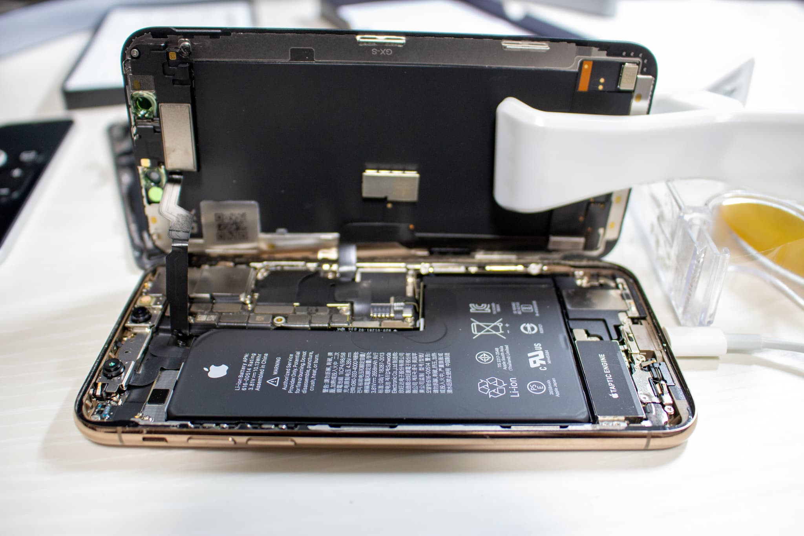

## ついた

無事電源が入りました！！！

もう一度電源を切って、蓋を閉めておきます。
耐水性がなくなってしまうので、付属したフレームステッカーを貼るのを忘れないようにしましょう。

閉めるときに、おしりのネジを片方なめてしまったことは内緒です。

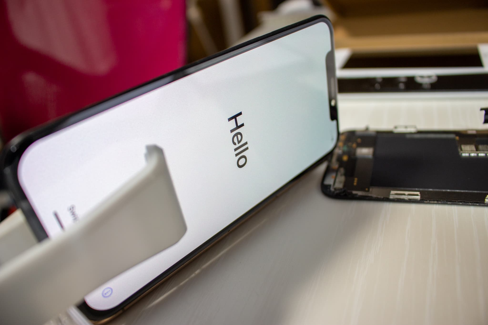

## 交換ディスプレイのレビュー

今回購入したディスプレイのレビュー欄には、3D Touch の感度が悪いとありました。

私が試した感じだと、やはり 3D Touch は押し込んでも反応しないことが8割くらいあります。

現在2ヶ月くらい利用していますが、ディスプレイ自体はきちんと使用できています。ただ、気づいた点もいくつかあるのでまとめておきます。

- 正規品じゃないので、True Tone 機能が使えなかった。
- 3D Touch は 1秒くらい長押ししてから押し込むと反応する。
- ディスプレイの下部のカーブが正規品と異なる。（角の表示範囲が若干異なる）

ただ、この iPhone XS のゴールドの色や形は気に入っているので、これからも修理しながら大切に使っていこうと思います！

***追伸：お風呂用の防水 Bluetooth スピーカーを購入しました。***