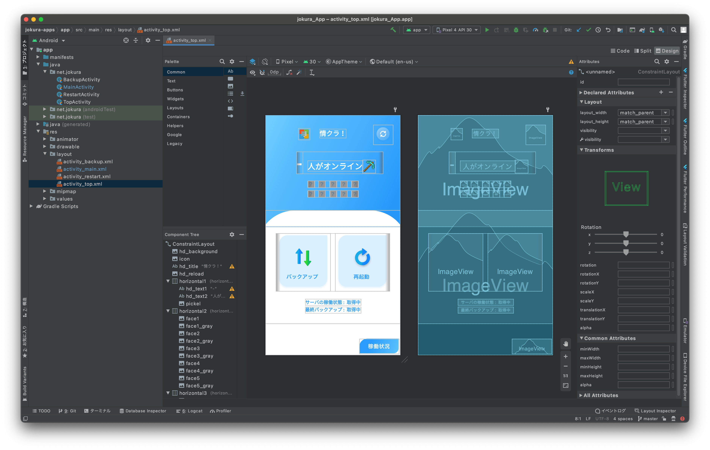
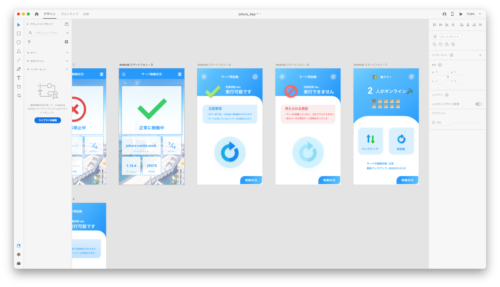
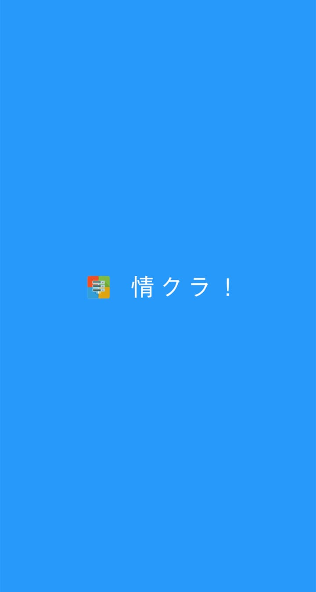
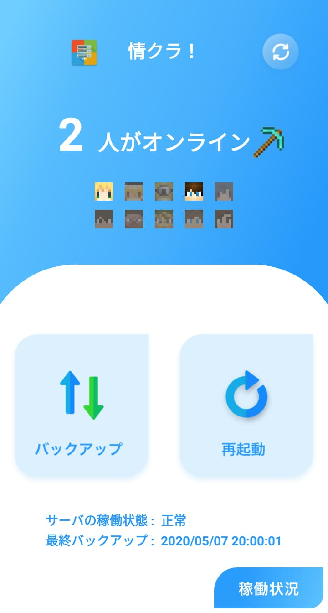
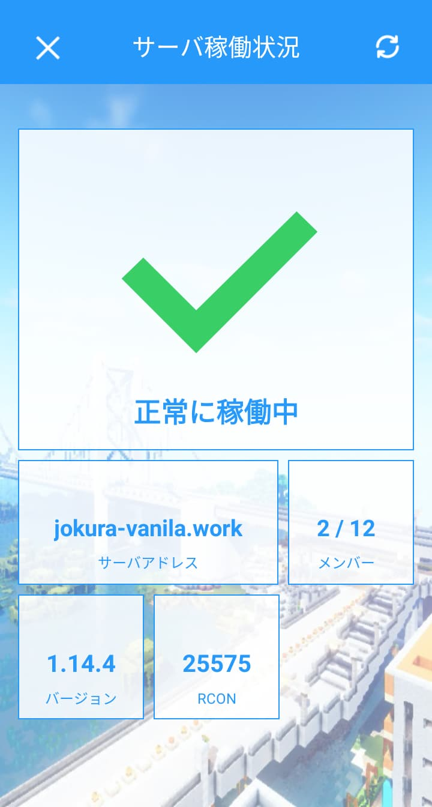
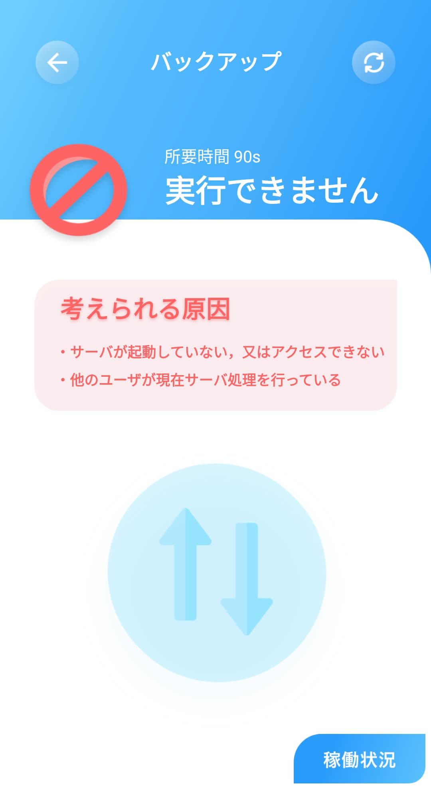
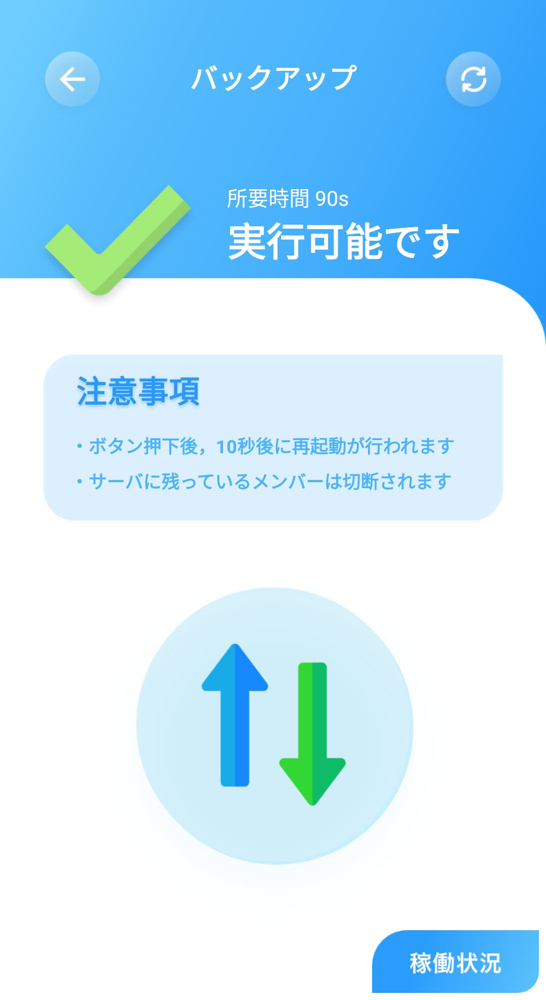

## やっぱアプリ化、したいよね！！

Webベースのツールを作ると、そのアプリ版を作りたくなる、ここまでがテンプレですよね。

今回は、ストアにリリースが手軽な Android アプリを制作したいと思います。


## Android Studio 使いやすい...

この時、プログラミングというものに触れてまだ半年もたっていませんでした。
なので初心者でも使いやすい Visual Studio Code を当時愛用していました。（今でも時々使っています）

しかし今回アプリ開発というのもあり、デバッグのしやすいエディタを使うことにしました。
まぁもちろん Android Studio 一択になるわけですが。
JetBrains 社が開発したソフトウェアを初めて触ったのですが、
これがまた使いやすいソフトウェアで感動したのを覚えています。
（私が JetBrains 信徒になる話はまたいつか）




## さぁ開発だ！

の前に、デザインを作っていきます。

スマホによってサイズが異なるので、対応できるデザインを意識して作成しました。




## コーディング すべしぬべし

今回の技術的な部分です。サーバーの様子を取得するのとリクエストを送る機能をつけます！（大したことはしてませんが）



まず、オンラインプレイヤーの取得部分です。
ホーム画面の上半分には、オンラインのメンバーが一覧でわかるようにしています。

今回、Minecraftの画像を取得するAPIを自作しました。
そこからAndroidに画像を取得するようにしています。
APIからの画像取得には、Picasso というライブラリを使用しました。

> **Picasso（公式サイト）** [https://square.github.io/picasso/](https://square.github.io/picasso/)

具体的には、以下のような書き方でさくっとインターネットから画像取得ができちゃうものです！

```javascript
Picasso.get()
    .load("https://jokura.net/api/getSkin?id=minecraft_id") // 今回作成したAPI
    .into(face1);
```

`face1`というのは ImageView の id で、APIから取得した画像を流し込んでくれます！

また、プレイヤーがオンラインかどうかは、用意したAPIから返ってきた情報を元に表示を切り替えます。
APIからのGET・POSTメソッドには、便利な OkHttp3 などの便利なライブラリがありますが、
この時は初心者だったこともあり、Java通信（HttpUrlConnection）で実装しました(笑)

```javascript
var connection: HttpURLConnection? = null
var reader: BufferedReader? = null
val buffer: StringBuffer

try {
    val url = URL( /* 通信するAPI */ )
    connection = url.openConnection() as HttpURLConnection
    connection.connect()  // ここで指定したAPIを叩いています。

    // 取得したデータを処理していきます。とりあえず取得した文字をbufferに。
    val stream = connection.inputStream
    reader = BufferedReader(InputStreamReader(stream))
    buffer = StringBuffer()
    var line: String?
    while (true) {
        line = reader.readLine()
        if (line == null) break
        buffer.append(line)
    }

    // ここからJSONに変換していきます。
    val jsonText = buffer.toString()
    val parentJsonObj = JSONObject(jsonText)
    
    // オンラインメンバーの情報は、JSON内の top というキーの中に格納してあります。
    val parentJsonArray = parentJsonObj.getJSONArray("top")
    val detailJsonObj = parentJsonArray.getJSONObject(0)

    // player1さんのオンライン状況が取得できました！
    val player1: Int = detailJsonObj.getInt("player1")

    return player1

} catch (e: MalformedURLException) {
    e.printStackTrace()
} catch (e: IOException) {
    e.printStackTrace()
} catch (e: JSONException) {
    e.printStackTrace()
}

// 接続を切断してあげましょう。おつかれ！
finally {
    connection?.disconnect()
    try {
        reader?.close()
    } catch (e: IOException) {
        e.printStackTrace()
    }
}

// 失敗した時はnullやエラーコードなどを返しましょう。
return null
}
```

一部抜粋していますが、こんな感じでリクエストをかいています。


## ちょっと脱線しちゃいましたね

他にどんな機能を実装したのかみてみましょう！たぶんこちらの方が興味ありますよね (笑)



トップ画面には、「バックアップ」と「再起動」の2つのボタンが用意してあります。
この2つのボタンについては後述します。

また、「稼働状況」を押すとサーバーの現在の状況をみることができます。
今思うと、ここのデザインは Web 版と同じなので、
WebView で表示させるとよかったですね (笑)

とりあえず、今回は xml ファイルで view を丁寧に記述しました。


## 今回のメインディッシュ

本アプリのメイン機能は、なんといってもこの2つです！

トップに設置されている「バックアップ」「再起動」の機能について説明します。



この Activity の開始と同時に、バックエンドと通信して 再起動 または バックアップ が実行できるか確認して、表示を切り分けます。

実行できない例としては、

- サーバーが停止している
- 他のユーザが現在処理を行っている
- 処理実行後のクールタイムにある

のいずれかですね。右上の更新ボタンで最新情報を再取得できます。


## 今回、神経を使ったのは処理部分でした

なんといってもサーバー関連で怖いのが、リクエストが同時に送られることですよね。

今回、サーバーを制御できるプラットフォームが複数あるため、他のアプリやWebサイトから同時にリクエストが送られた場合、最初のリクエストのみ通す必要があります。
また、再起動やバックアップなどが実行された後は、クールタイムを設ける必要もあります。

そういった、さまざまなリクエストを処理できるように、情クラ！ではバックエンドのAPIを用意し、そこからサーバー処理を行っています。
リクエストが失敗した場合には、その理由をエラーコードで返しユーザに通知しています。 
実行可能の状態でボタンを押した場合でも、バックエンドでキャンセルされた場合その旨のトーストが表示されます。


## ２年の月日を経て...

[前回の記事](../jokura-web)でも述べた通り、情クラ！はサービス終了しました。

今回、"プログラムの整合性" というものを勉強できた、サービス開発だったと思います。

他にも Minecraft 関係で得た知見はかなり大きいものだったので、今後何か一般向けのサービスに繋げていきたいと思います。
