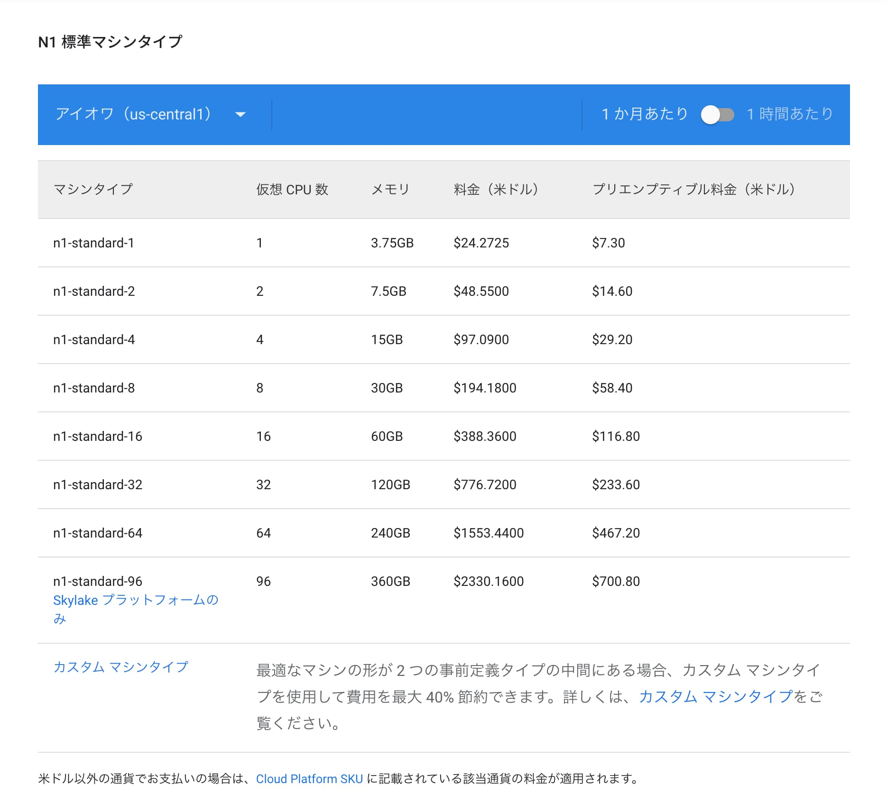
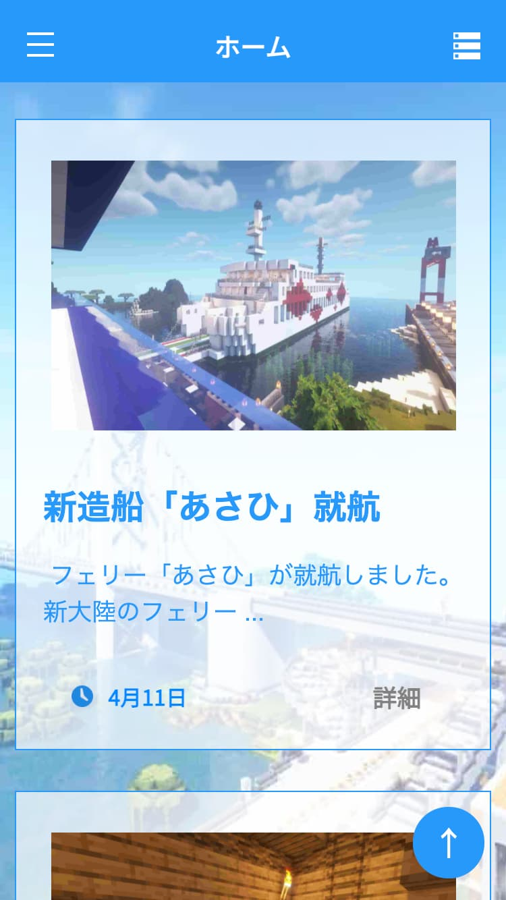
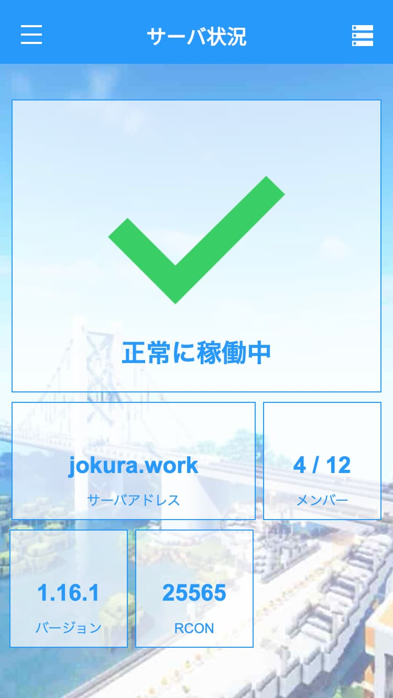
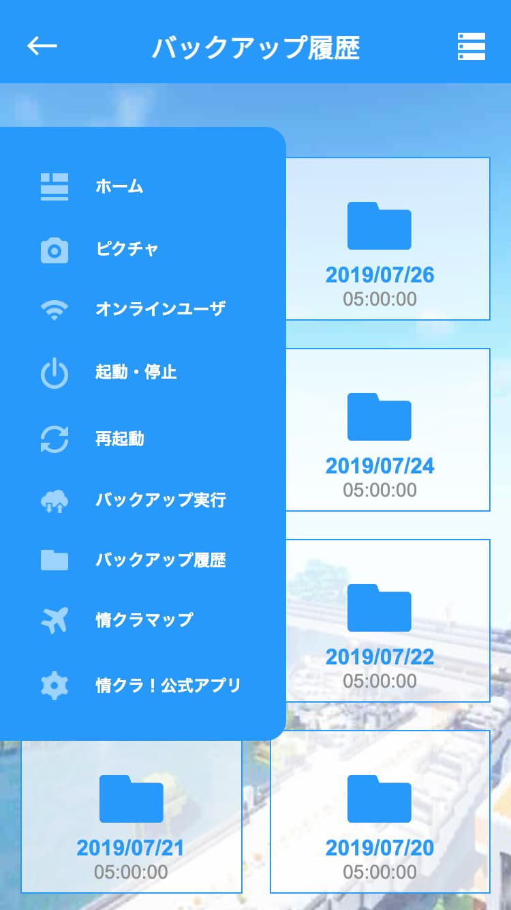
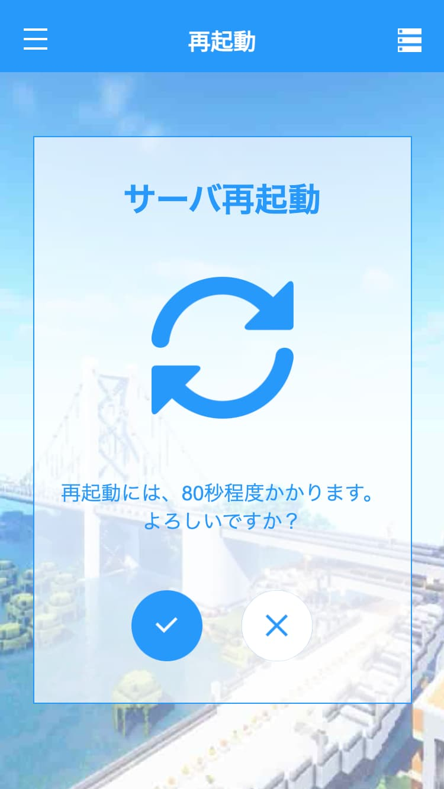

## Minecraft っていいよね

Minecraft って、複数人でプレイすると沼ですよね。

「 情クラ！」という、知り合い十数名程度の Minecraft サーバーで遊んでいるのですが、
今や大陸内には高速道路が広がり、複数の大陸間には大きな橋が建築されています。（やばすぎ）


## ある日、Minecraft のサーバー管理者になった

最初はみんなで家に集まって、ローカルでサーバーを建ててプレイしていました。
しかしプレイヤーがどんどん増えてきたため、Google Cloud Platform（GCP）でサーバーを立てることにしました。

これが、「情クラ！」という Minecraft サーバーの誕生のきっかけです。

いつどこでも Minecraft サーバーで遊べる環境が完成し、ワールドの発展度合いが加速度的に大きくなったのですが、
しかし1つ大きな問題がでてきました。

これは、Google Cloud Platform（GCP）がまだ365日無料トライアルだった頃の話なのですが、
当時GCPには、年間 30,000円分の無料クレジットが付属していました。
それをちょうど1年間で使い切る`n1-standard-1` プラン（仮想 CPU 数: 1, メモリ: 3.75 GB）で運用していたのですが、
大人数が長時間プレイしていると動作がもっさりしてくるのです。



サーバー管理者だった私は、連絡を受けるたび SSH 接続してサーバーを再起動していました。

ですがここは、ぜひ技術の力で課題解決をしよう！ということで、Minecraftサーバーを誰でも簡単に制御できる、Webアプリケーションを作成することになりました。


## まずは完成品をどうぞ



最初に実装したのは、「ホーム」のお知らせ（左）と「サーバー状況」の確認画面（右）です。
モバイルファーストのデザインですが、きちんとレスポンシブ対応させています。

以下、それぞれの軽い機能紹介です。

|  ページ     |  機能                                             |
| ----       | ----                                             |
|  ホーム     |  プレイヤーが自由に建築報告を投稿することができます       |
|  サーバー状況  |  サーバーの起動・停止状況やオンラインメンバーを確認できます  |


## ここで、少し技術的な話をしましょう

一応そういうブログ（ ？）なので、今回 Minecraft サーバーと連携したノウハウについて記述しておきます。

Minecraft サーバーでは、ある特定のパケットを受け取ると、現在のサーバーのステータスを返す機能が搭載されています。
[こちらのページ](https://wiki.vg/Server_List_Ping)に詳しい仕様が載っています。
これらの仕様は、Minecraft 起動時のマルチプレイ選択画面などに利用されているそうです。

続いて、詳しい仕様について順を追って説明していきます。

まず、クライアント側が以下のような Handshake パケットを送信します。

|  Packet ID  |  Field Name        |  Field Type      |  Notes  |
| ----        | ----               | ----             | ----    |
|  0x00       |  Protocol Version  |  VarInt          |  See protocol version numbers. The version that the client plans on using to connect to the server (which is not important for the ping). If the client is pinging to determine what version to use, by convention -1 should be set.  |
|  ^          |  Server Address    |  String          |  Hostname or IP, e.g. localhost or 127.0.0.1, that was used to connect. The Notchian server does not use this information. Note that SRV records are a complete redirect, e.g. if _minecraft._tcp.example.com points to mc.example.org, users connecting to example.com will provide mc.example.org as server address in addition to connecting to it.  |
|  ^          |  Server Port       |  Unsigned Short  |  Default is 25565. The Notchian server does not use this information.  |
|  ^          |  Next state        |  VarInt          |  Should be 1 for status, but could also be 2 for login.  |

ここで重要なのが、このレスポンスを待たずに続けてリクエストパケットを送信します。
その応答パケットとして、サーバーが以下のようなJSONを返します。

```json
{
    "version": {
        "name": "1.16.1",
        "protocol": 47
    },
    "players": {
        "max": 12,
        "online": 5,
        "sample": [
            {
                "name": "minecraft_name",
                "id": "4566e69f-c907-48ee-8d71-d7ba5aa00d20"
            }
        ]
    },
    "description": {
        "text": "Hello world"
    },
    "favicon": "data:image/png;base64,<data>"
}
```

このJSONを使って、サーバの各情報が取得できます。

また、このパケットを送信するライブラリを探してみたところ、
[C#](https://gist.github.com/csh/2480d14fbbb33b4bbae3)・
[Java](https://gist.github.com/zh32/7190955)・
[Python3](https://gist.github.com/ewized/97814f57ac85af7128bf)・
[PHP](https://github.com/xPaw/PHP-Minecraft-Query)
用に作られたコードが見つかりました。
今回は、PHPライブラリを使用しました。


## 実装した機能

あまり技術的な話をすると長くなっちゃいそうなので、次に行きます。

他に実装した機能も紹介します。



|  ページ            |  機能                                                                     |
| ----              | ----                                                                     |
|  ピクチャ           |  プレイヤーが自由に画像を投稿することができます                                  |
|  オンラインユーザ    |  ホワイトリストに登録されたプレイヤーが表示され、サーバーに入っているかどうかがわかります  |
|  起動・停止         |  サーバーをしばらく利用しない場合は、GCP課金対策のためにサーバーを切ることができます       |
|  再起動            |  Minecraft サーバーを再起動させることができます                                  |
|  バックアップ実行    |  Minecraft サーバーのバックアップを作成します（毎日5:00に定期実行されます）           |
|  バックアップ履歴    |  バックアップ履歴の一覧を表示します                                            |
|  情クラマップ       |  情クラワールドの建築物紹介が載っています                                        |
|  情クラ！公式アプリ  |  公式アプリへのリンクです                                                     |


## みんなログインしよう

今回サーバーのコントロール機能が Web に公開されるので、ログイン機能を実装する必要があります。
全員 Google アカウントを持っていたので、Firebase Authentication を使って Google ログインを実装しました。

Firebase に関する記事はたくさんあると思うので、今回説明は省略します。

以下の公式ドキュメントを読むとよくわかりますよ（雑）

> **Firebase Authentication（Google）** [https://firebase.google.com/docs/auth/web/start?hl=ja](https://firebase.google.com/docs/auth/web/start?hl=ja)


## マイクラサーバーのバックエンドはどうなってるの？

Minecraft サーバーでは、Node.js + TypeScript でAPIを構築しています。

たとえば、以下は Minecraft サーバーを起動するルーティングの一部抜粋です。

```typescript
// --- Start Server ------------------------------------------------------------
router.post('/api/run/start', (req: express.Request, res: express.Response) => {
    const schema = Joi.object({
        user: Joi.string().required(),
    })

    const validation = schema.validate(req.body)
    if (validation.error) {
        post("不正なリクエストを拒否しました", "ユーザ固有IDが設定されていないリクエストが送信されました", 3)
        res.status(400).send('Bad request')
        return
    }

    statusAsync(req.body.user)
        .then(() => {
            startAsync(req.body.user)
                .then(() => {
                    res.send('Success')
                })
                .catch((err) => {
                    if (err == 'failed due to run interval')
                        post("起動コマンドを拒否しました", "前回の処理の実行から" + process.env.WAIT_SECONDS_FROM_LAST_PROCESS + "秒経過していないため、コマンドを拒否しました。", 2)
                    else
                        post("起動コマンドを拒否しました", "サーバーが既に起動しているため、起動コマンドを拒否しました。サーバーとの同期ができていない恐れがあります。[Err: startAsync()]", 2)
                    res.status(400).send('Bad request')
                })
        })
        .catch(() => {
            post("起動コマンドを拒否しました", "既に起動しているため、起動コマンドを拒否しました。サーバーとの同期ができていない恐れがあります。[Err: statusAsync()]", 2)
            res.status(400).send('Bad request')
        })
})
// -----------------------------------------------------------------------------
```

まず、Joi という npm パッケージを利用して、送信されたクエリパラメータなどのバリデーションを行います。
そして、post( ) という関数がありますが、これはサーバーのエラーなどを Discord のサーバーに通知するための関数として用意してあります。
server.jar は screen 上で走らせているのですが、screen の二重起動にならないように初めに起動してもよいかのチェックも行っています。

また、実行系はシェルにまとめてあります。

```shell
#!/bin/bash

JARFILE=/home/jokura_server/minecraft/server.jar

MEM=15000M

cd `dirname $0`
screen -UAmdS minecraft java -server -Xms${MEM} -Xmx${MEM} -jar ${JARFILE} nogui
```

上記のファイルは、起動用のシェルです。

他にも再起動用やバックアップ用などのシェルも用意してあります。（下記は 再起動用）

```shell
#!/bin/bash

WAIT=30

STARTSCRIPT=/home/jokura_server/minecraft/start.sh

SCREEN_NAME='minecraft'


screen -p 0 -S ${SCREEN_NAME} -X eval 'stuff "say '${WAIT}'秒後にサーバーを再起動します\015"'
screen -p 0 -S ${SCREEN_NAME} -X eval 'stuff "say すぐに再接続可能になるので、しばらくお待ち下さい\015"'

sleep $WAIT
screen -p 0 -S ${SCREEN_NAME} -X eval 'stuff "stop\015"'

while [ -n "$(screen -list | grep -o "${SCREEN_NAME}")" ]
do
	sleep 1
done
	$STARTSCRIPT
```


## 今現在の 情クラ！

今は残念ながら、Webサービスを終了しています。
（Minecraft の活動自体はしています！）

2021年4月から、Minecraft サーバーを別のメンバーが自宅サーバーで建ててくれることになりました。
やはり GCP などの従量課金制のサーバーで運用するには、かなり気を使ってしまうので正直解放されました。

かといって、情クラ！での活動はまだまだ続けていく予定なので、ぜひこのブログでも活動を共有していけたらなと思います！


