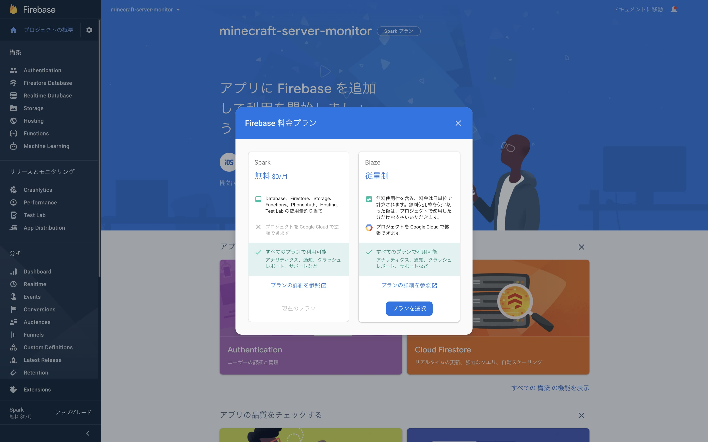
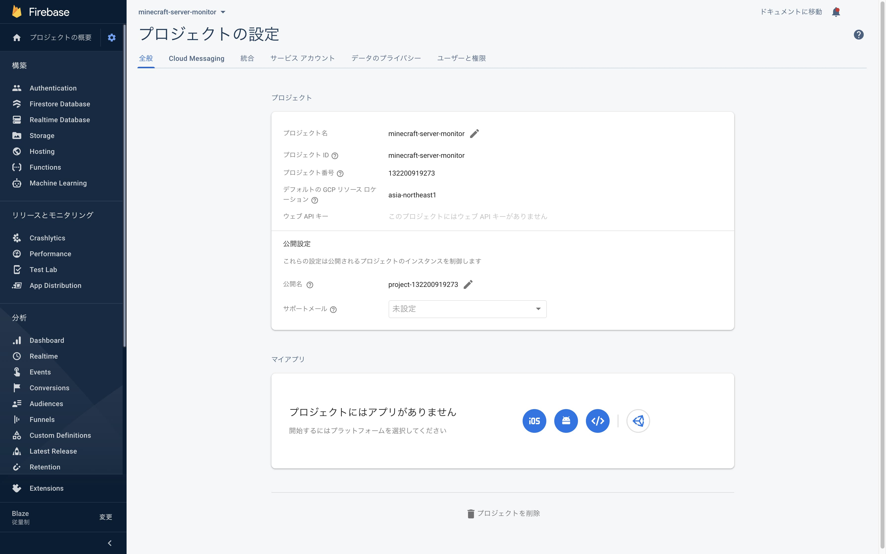
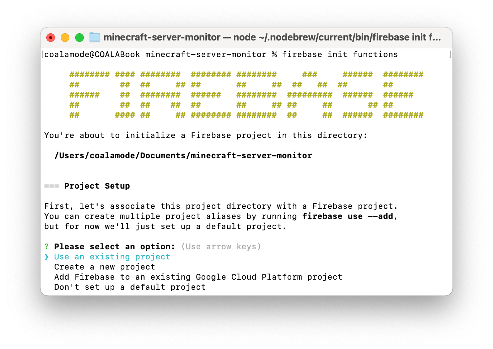
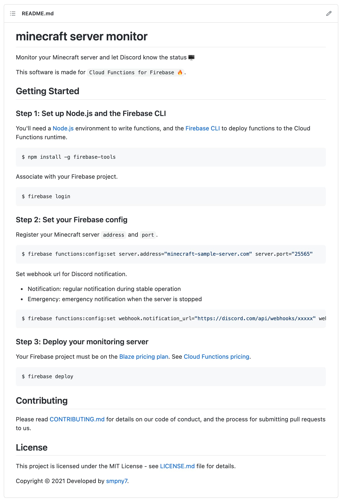
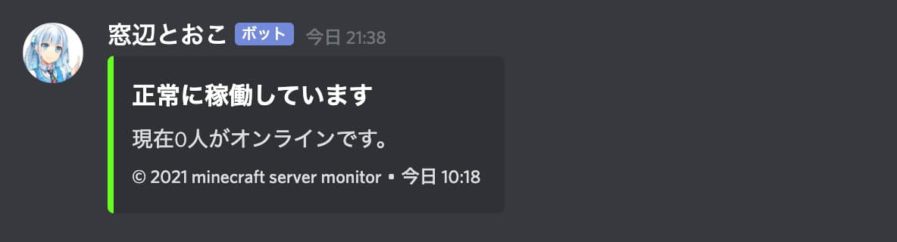
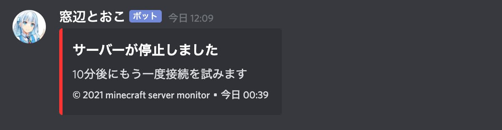

## 今回の Firebase は一味違います

今回作成する監視サーバですが、Google Cloud Platform の Cloud Scheduler を使って、Firebase の Cloud Functions を定期実行させます。

Cloud Scheduler と Cloud Functions の連携方法ですが、
Google が用意してある `firebase-functions` というライブラリに付随しているスケジュール機能を使用することで、
自動で GCP の Cloud Scheduler に登録されます。


## 天下のGoogle様様

Firebase で定期実行って、かなり金銭的なコストがかかりそうですよね。

Web サーバーなどとは違い、時間指定のあるジョブ（ Worker ）になるので、
結構ホスティングサービスも少ないですし、今回作成する監視サーバーは10分毎に定期実行します。

**ですが、Cloud Functions では月200万回までの呼び出しは無料です！！**

具体的に、関数の呼び出しの課金は以下の通りです。

|   月間呼び出し回数   |  料金（100 万回あたり）  |
|       :---:       |         :---:         |
|   最初の 200 万回   |         無料          |
|  200 万回を超えた分  |        $0.40         |

今回は、かなり複雑なDBの整形ジョブやWebサービスのCRONジョブをするわけではないので、無料枠で十分です。

**ただし気をつけないといけないのが、関数のデプロイには料金がかかります。**

まず、関数は無料枠のない Container Registry に保存されるため、デプロイ後にわずかな料金が発生します。
Container Registry のストレージ費用は、1 GB あたり月額約 $0.026 です。

そして、関数のデプロイごとに約 1 分の Cloud Build による処理が行われます。
料金は $0.003/ビルド分 ですが、1 日あたり最初の 120 ビルド分は無料です。

はい、もうほとんど無料ですね。

Firebase の料金プランは、Spark → Blaze にアップグレードしておく必要があります。
また、有効な支払い方法を登録しておく必要があります。




## Cloud Functions プロジェクトの作成

Cloud Functions にデプロイするには、Firebase CLI を導入する必要があります。

```shell
$ npm install -g firebase-tools
```

お使いの Google アカウントでログインしておく必要があります。

```shell
$ firebase login
```

最後に、プロジェクトを新規作成するには

```shell
$ firebase init
```

で新規プロジェクトを作成できます。が...


## firebase init でハマった！

`firebase init` を実行すると、なにやら不穏なメッセージが出ます。

> Error: Cloud resource location is not set for this project but the operation you are attempting to perform in Cloud Firestore requires it. Please see this documentation for more details: https://firebase.google.com/docs/projects/locations .

新規 Firebase プロジェクトを利用する際には、初めにリージョンを設定しておかないといけないそうです！



GCP リソースロケーションについては、以下の通りです。一度設定すると変更することができないので注意です！

| リージョン名（Tier 1） | 地域 |
| :--- | :--- |
| us-central1 | アイオワ |
| us-east1 | サウスカロライナ |
| us-east4 | 北バージニア |
| europe-west1 | ベルギー |
| europe-west2 | ロンドン |
| asia-east2 | 香港 |
| asia-northeast1 | 東京 |
| asia-northeast2 | 大阪 |

無難に、`asia-northeast1` か `asia-northeast2` あたりがいいと思います。

これできちんと新規プロジェクトの作成ができました！




## Cloud Functions の環境変数について

Cloud Functions には、環境変数を設定できるのですが、`.env` ファイルではありません。
firebaseプロジェクト内に、オブジェクト形式で保存されていきます。

例えば今回のプロジェクトでは、`address` と `port` という環境変数が必要になるのですが、

```shell
$ firebase functions:config:set server.address="minecraft-sample-server.com" server.port="25565"
```

上記のコマンドで、環境変数を設定できます。

プロジェクトの環境構成に現在保存されているものを調べるには、
```shell
$ firebase functions:config:get
```
で、JSON が出力されます。


## 環境変数をローカルエミュレート時に使えるようにする

Cloud Functions の環境変数を、ローカルエミュレート時にも使うことは多いと思います。

調べてみたところ、`.runtimeconfig.json` というファイルに環境変数の JSON を出力して
`functions` ディレクトリ直下に置いておくことで、ローカルでも環境変数を取り込むことができるそうです。

```shell
$ firebase functions:config:get > .runtimeconfig.json
```


## 今回作成したもの

Minecraft サーバーを監視し、サーバーが落ちた際に Discord に通知してくれるサービス（Worker）を作成しました。

詳しくは以下の GitHub リポジトリを参照してください！


> [minecraft-server-monitor](https://github.com/smpny7/minecraft-server-monitor)　Monitor your Minecraft server and let Discord know the status 🖥


## Discord の 情クラ (minecraftサーバー) チャンネル

Discord にサーバの状態をログとして投げてくれます。

ボットの名前とアイコンは、メンバーに勝手に変えられているので気にしないでください。。



また、GCP の minecraft サーバーが落ちたときは、通知用チャンネルに投稿されます。




## おわりに

Firebase は最高ですね！