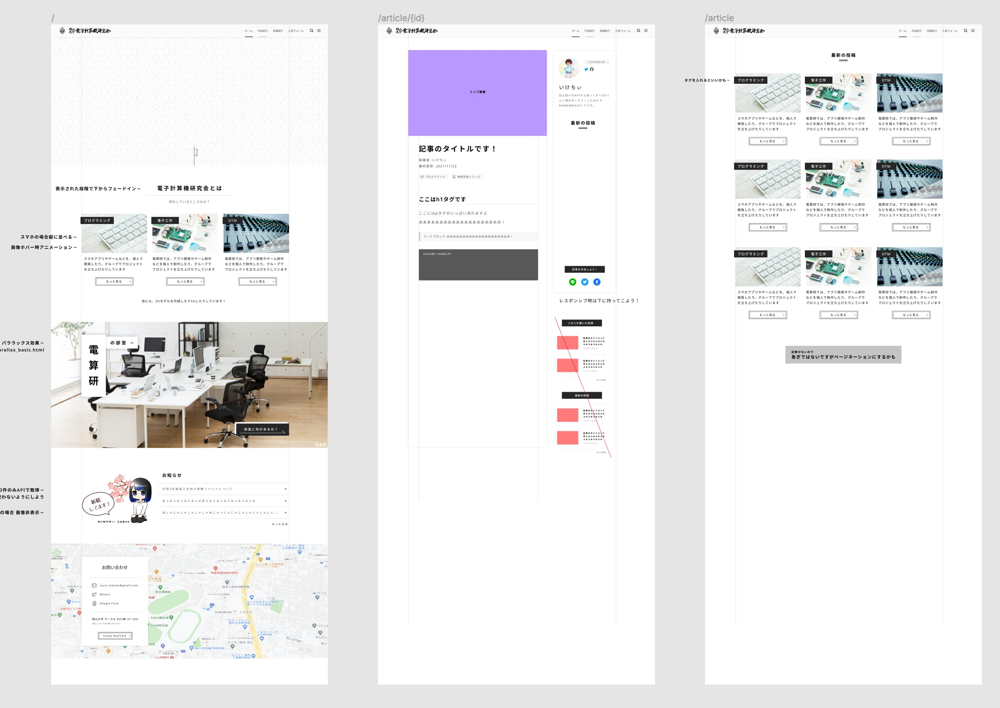
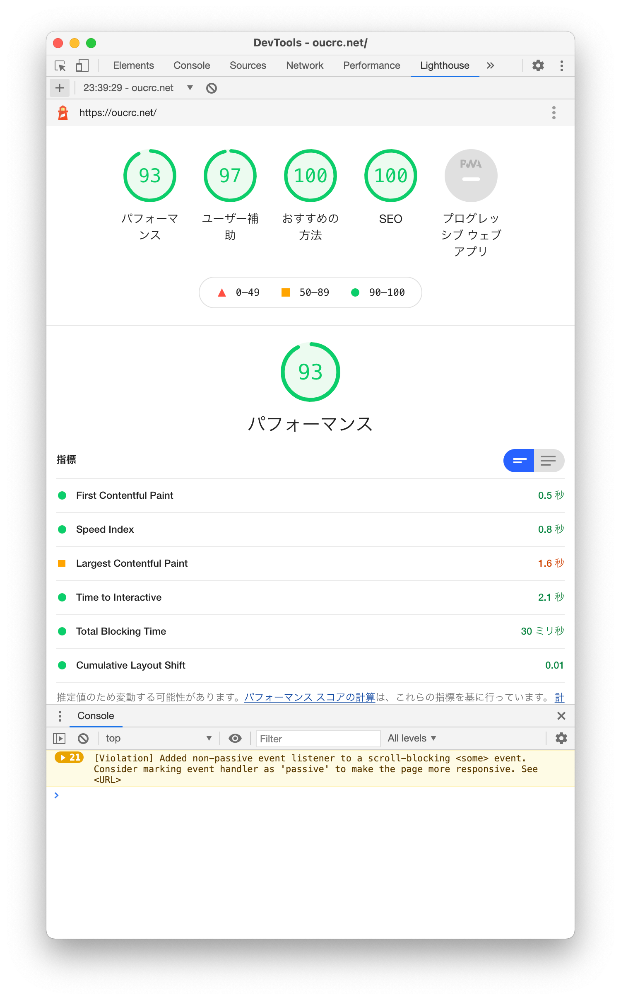

## 部員が記事を投稿できるようにしたい

現在コロナ禍真っ最中。
岡山大学 電子計算機研究会では、オンライン慣れ（？）してますので、Discord で普段と変わらず部会をしたりゲームしたりしてコミュニケーションを取れているわけですが、もちろん**対面での学祭やコミケなどの、制作物をアウトプットする場はここ１年以上ないまま**です。

電子計算機研究会では、各々がいろんな活動をしています。例えば、プログラミングや電子工作、3Dプリンターや3Dモデルで遊んでいる人もいますし、DTM ガチ勢も多いです。
例年はコミケなどで、そういった活動を記事にして1冊の本として出すのですが、その場も失われているため、部長としてこりゃいかん（ ？）と感じ、**ホームページ上で記事を公開できるように改築しよう**と思います！

## 部で「Webリニューアルチーム」を立ち上げる

ちょうど3月で、来月から新入生も来るということで、もっと部のことを知ってもらおうと思い、少し新歓向けにリニューアルすることにしました。

- 部員が記事を投稿できる機能
- 部員のプロフィールページ（SNS や GitHub へのリンク付き）
- 部室の紹介ページ
- 入部申し込みフォーム
- 部からのお知らせ

ここら辺を実装していきたいと思います！

「Webリニューアルチーム」には、6,7名の部員が参加してくれました。
半分ずつに分かれ、フロント（Nuxt.js）班とバックエンド（microCMSのセットアップやデータ登録）班を作り、作業開始です！

最初は Nuxt.js + microCMS ではなく、実は WordPress で実装しようとしていました。
そんなに新しいものではありませんが、記事を投稿するなら WordPress という印象が強かったので選んだのですが、**WordPress についての知識が無く、簡単なのだろうと下調べをしていなかったため、Git管理の仕方が難しくグダグダになってしまいました**...（部員の皆さんすいません...）

結局初日は作業量0で終わってしまいました。

そんな中先輩にヘッドレスCMSでの構築を提案していただき、Nuxt.js をフロントに計画を練り直すことにしました。

## デザイン作成

まずは、作業分担しながら進められるように、デザインを作っていきます！

## 恐るべき開発スピード

フロント班は自分含め3人で全てのページの実装をしたのですが、開発開始から約3日でほぼ全てのページが完成しました...！？
春休みということもあり、常に誰かがプルリクエストを出している状態で、恐るべきスピード開発でした。

## Nuxt.js 便利！！

Vue.js で開発をする場合、`vuex` や `vue-router` を入れる必要がありますが、その手間を省けるのが一番大きいかなと思います。また、記事が更新された時にビルドすれば大丈夫なので、静的サイトに設定してますが、かなり読み込みは早いと思います。

## 入部フォーム

今回、入部フォームどうしようかな（Google Form でも埋め込もうかな）と考えていたのですが、面白い記事を発見しました。

> https://www.gorilla-web.net/2020new_google_form_custmize/

...ん、天才じゃない ？？

今回はこの方法を採用し、Google スプレッドシートで管理できるようにしました。

## 最後に

すごい大満足な仕上がりになった割には、書くことがなくて困っていますが、後輩とのホームページの制作期間は楽しかったです✨

SPA・SSR・SSG あたりの勉強にもなりました。

岡山大学電子計算機研究会の公式HPでは、部員の活動を日々記事にして掲載しています。
かなり内容が面白いので、興味のある方は是非覗いていってください！

> [**岡山大学電子計算機研究会**](https://oucrc.net)　https://oucrc.net