## バックエンドは結構Javaが多いらしい

今まで、PHP や JavaScript（TypeScript）の Express でしかバックエンドを作ったことがありませんでしたが、他にも Java や Ruby で構築することも多いそうです。特に、**Java を使った Spring Boot には前から興味がありました！**

興味があるならやってみなさい、ということで、今回はSpring Boot を使ってバックエンドAPIを構築したいと思います。~~ちょうど現在受講中の夏季集中「オブジェクト指向言語」という講義で、課題があるそうなので、それの提出物にしちゃいましょう。~~

## Firebase が Spring Boot に対応 ！

2020年5月にどうやら Google Cloud Functions が Java（Spring Boot）に対応したらしいです！
Cloud Functions にデプロイできるのは node.js アプリケーションだけかと思っていました。。

まだ詳しくは決めてませんが、GCP 大好き人間なのでおそらく Firebase で運用すると思います！

## Java で書くとは言っていない

私は、コードがスッキリきれいに書け、null safety な Kotlin が大好きなので、今回は Spring Boot + Kotlin で実装したいと思います。
どうやら、Kotlin や Scala でも Spring Cloud Functions に対応しているそうです。

大学の先生に「提出は Java じゃなくて Kotlin でもいいですか...？」とおそるおそる訪ねたところ、快諾していただけましたので、Kotlin で書いていきます！本来であればオブジェクト指向の勉強なので getter/setter 等の勉強のため こういった言語やフレームワークは使うべきではないと思いますが、気にせず Spring の恩恵を受けていきましょう！（こら）

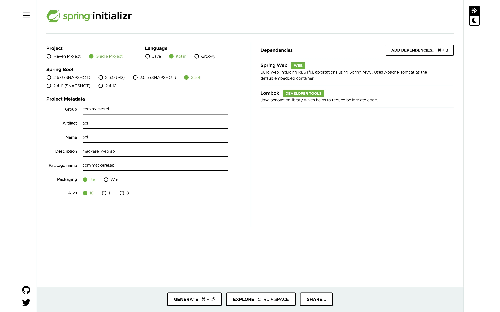

## 今回作るアプリ

ここは講義内容関係ないのですが、フロントのモバイルアプリでは、**Webサイトが落ちた際にアプリ通知してくれるようなもの** を作ろうと思います。複数のwebサイトを管理できるようにする予定です。そうです、~~`StatusC*ke` のようなサービスです~~。

## 実際に発表で使ったスライドを掲示

ここまで文字ばっかで飽きたと思うので、**実際に講義の最後で私が発表したスライド** を載せていこうと思います。

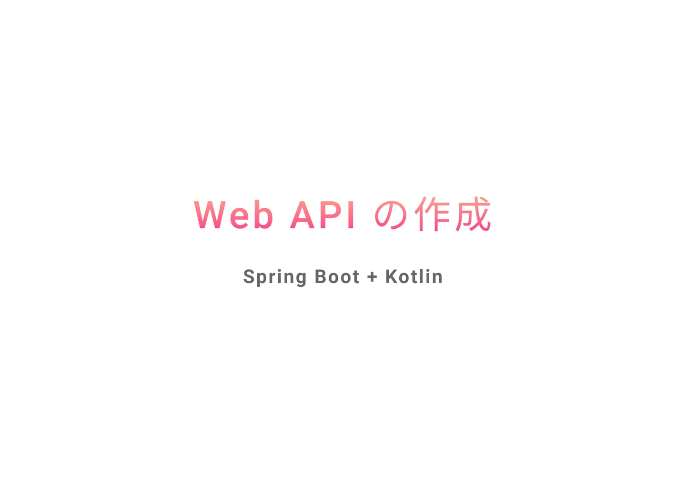

今回は Firebase を最大限に使ったモバイルアプリケーションの作成を想定しています。
オブジェクト指向言語の講義に関係あるのは、左上の Cloud Functions のところですね。

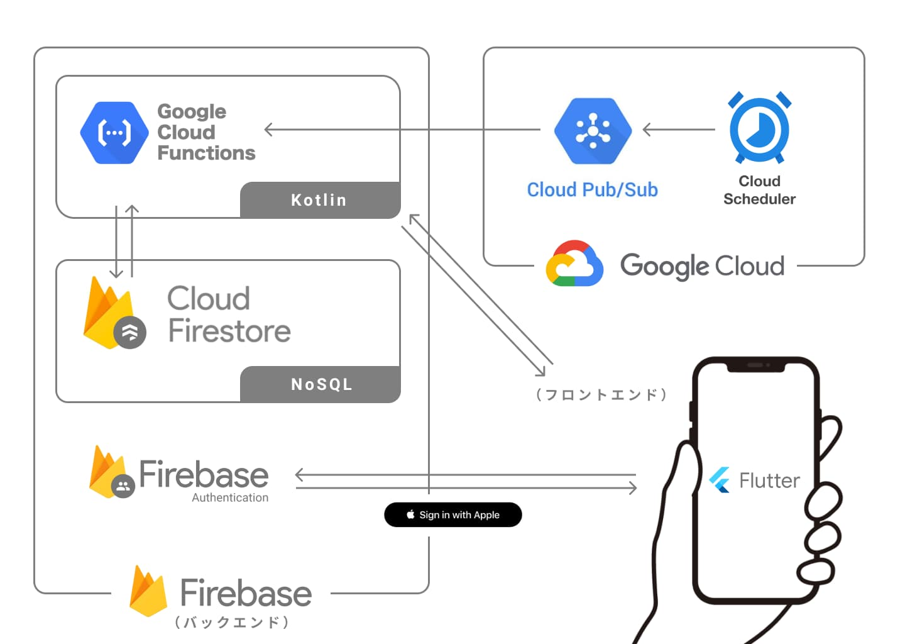

今回の発表では、フロント部分の実装が間に合いませんでしたが、APIからデータを取得していることがわかるよう、最低限の表示部分だけ完成させています。

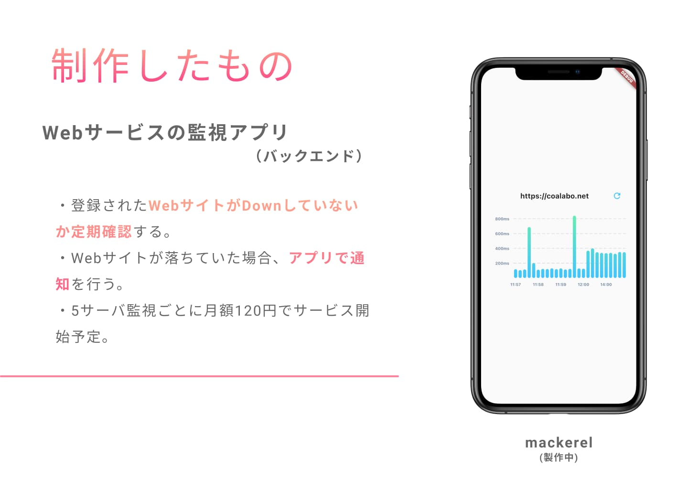

ここからただの Kotlin の布教です (笑)

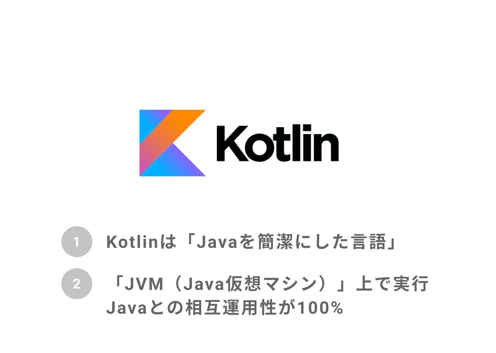

緊張しながらも熱弁しました。

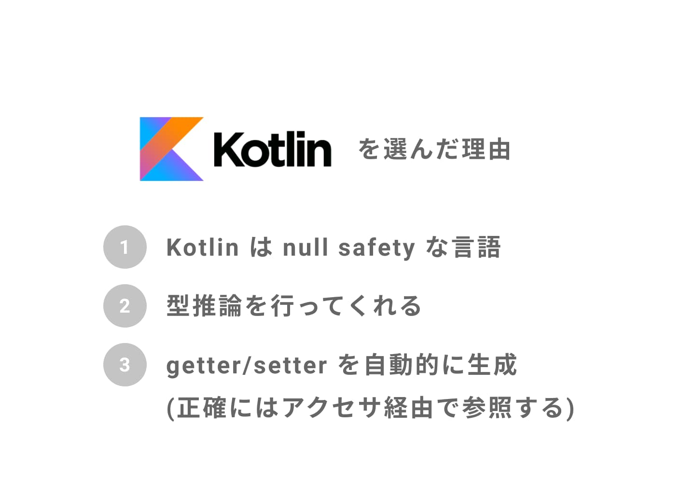

Kotlin についてはまだまだ経験が浅いので、Kotlin のコードをレビューしてくれる人が欲しいです。

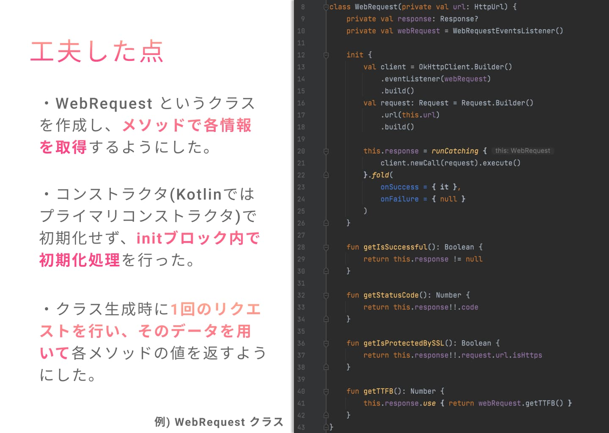

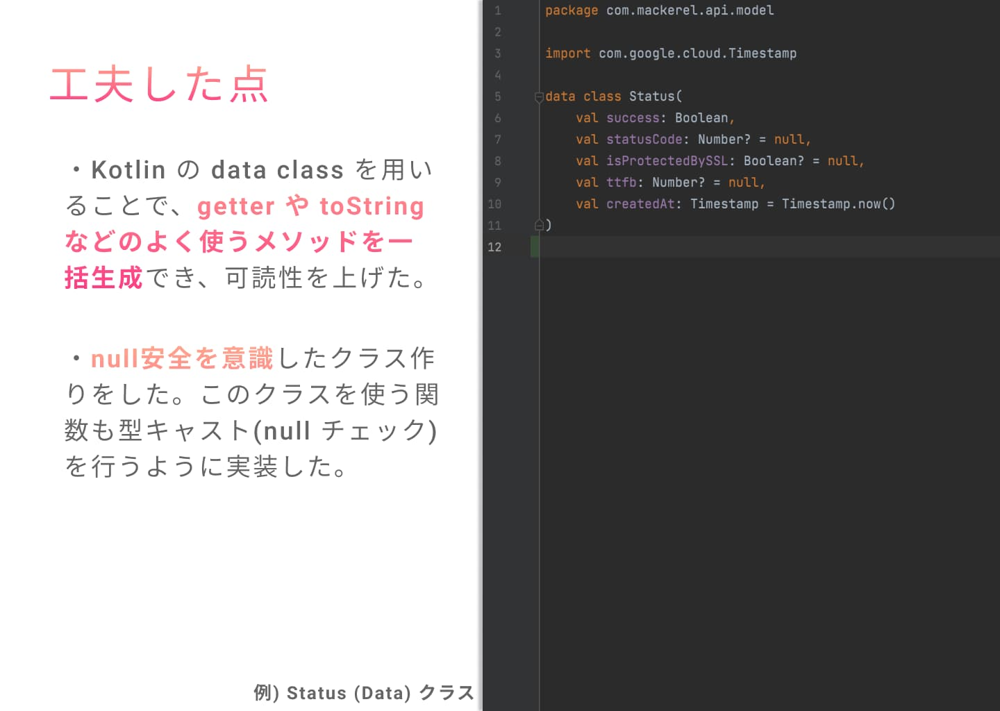

ここから、実際に制作した API がどのような動作をするのか、Postman を使ってプレゼンしています。

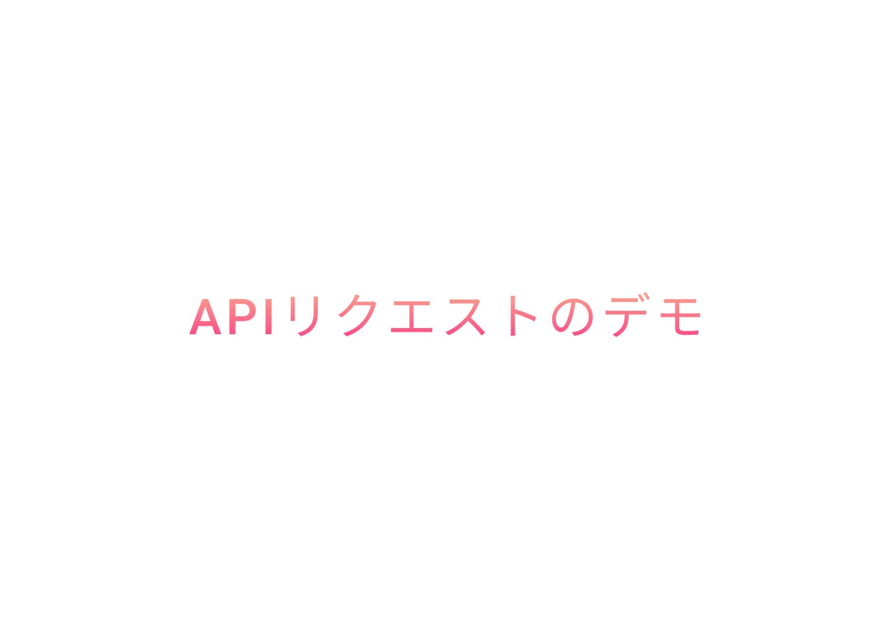

リクエストの様子はこんな感じ ↓

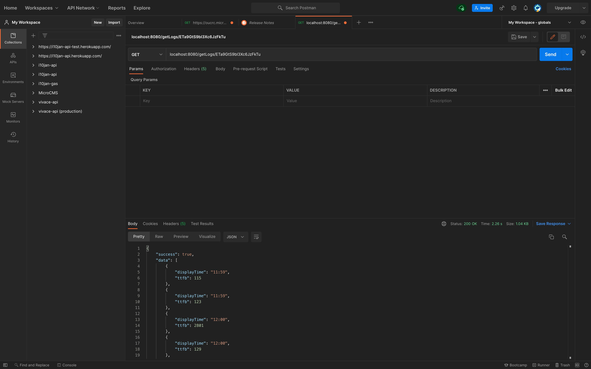

最後にフロントエンドで取得する様子を動かしています。

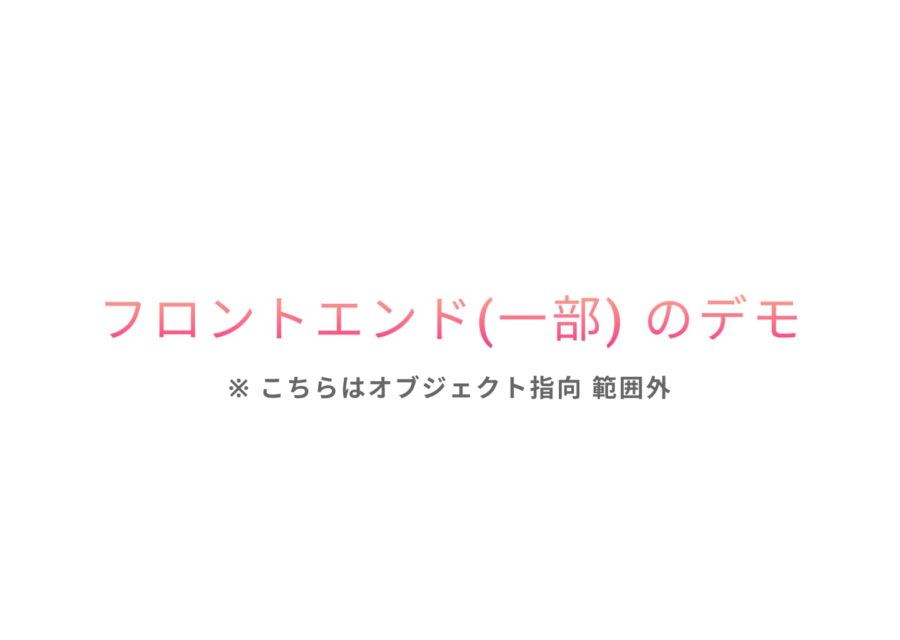

きちんとデータが取得できていますね。

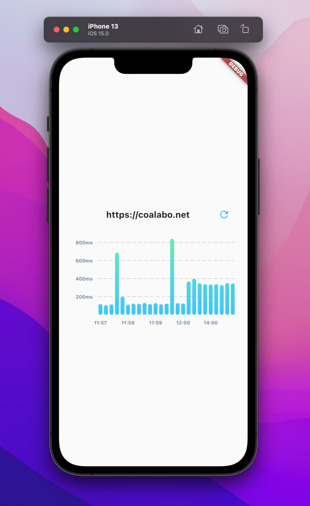

## 最後に

`StatusC*ke` のようなサービスを自分用にカスタマイズして作ってみたかったので、ちょうど良いタイミングで 講義・Spring と出会い、生かすことが出来たと思います。

フロントについては、完成次第また記事にしたいと思いますので、乞うご期待！