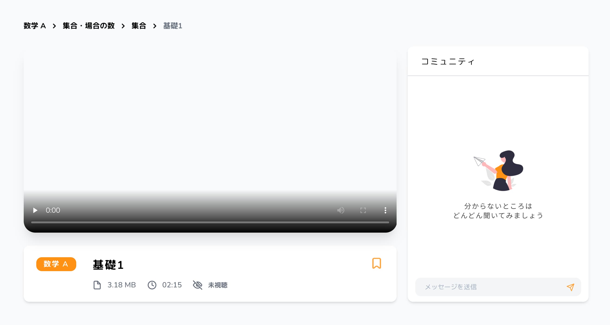
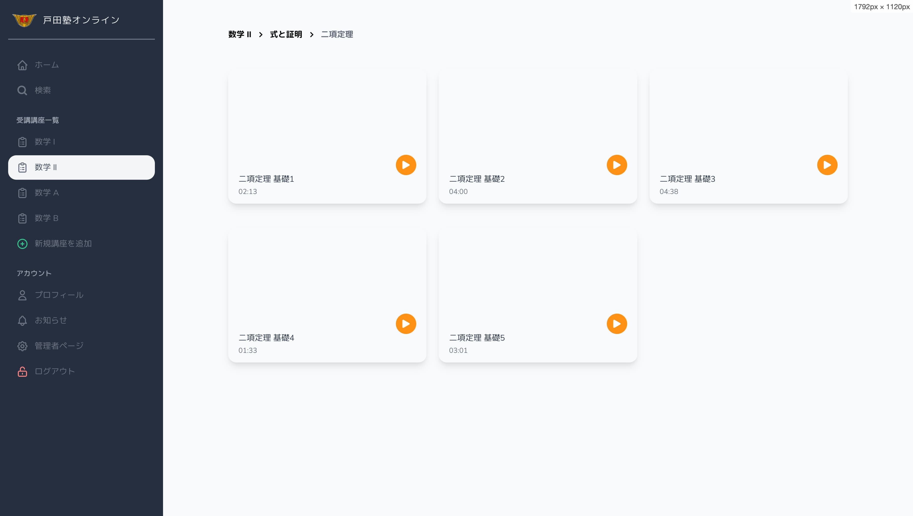
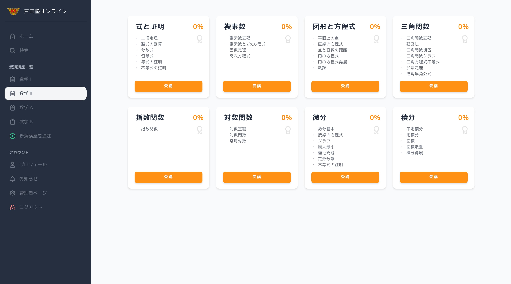
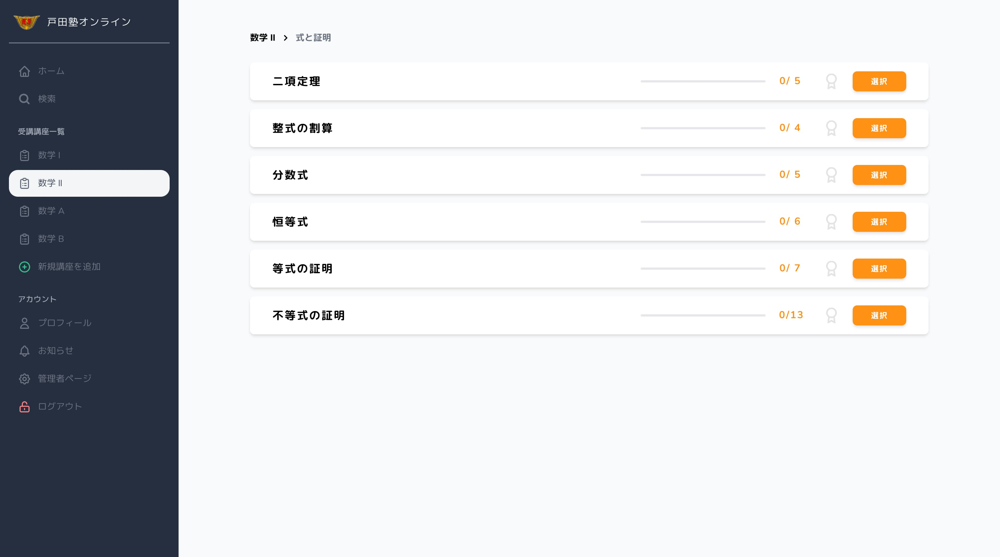

## 最近、EdTechって流行ってますよね

私が高校生の時は、映像授業というものを受けてる学生が多かったです。

映像授業は、塾の講義と比べて場所と時間が限定されませんし、何度でも授業を聞き直すことができるのでとても評判が良かったです。
ただ、**あれってすごく高い** ですよね。一番地元で有名だった映像授業は、4教科で年間100万円近くかかってたそうです。あれだけのシステムを作って、東京の本部で撮影しているため、コストが高いのですかね...？

もちろんそんなシステムは、個人塾や地方の塾では到底構築できません。
しかし、あまり塾にお金を出せない学生でも、オンラインの恩恵を受けられる選択肢があってもいいと思います。

ということで、地方の塾ではありますが、数学・物理専門の戸田塾と映像授業が見られるサービスを開始しました。

## 作成したもの

収録した映像をログインユーザが見れるのは最低限として、付加価値としてさまざまな機能をつけたいと思います。

まずは、各講義映像に紐づいたオープンチャット欄をつけていきます。
これは、1つの講義動画に対して質問があった際に、受講生がその動画の横にあるチャット欄で質問をすることができます。また、このチャットは全員が見れるようにしてあり、先生以外にも回答することができたり、同じ質問を持つ受講生が回答を見て理解できるような仕様になっています。

また、WiFiなどの通信環境がない生徒のことを考慮して、動画のファイルサイズを表記したり、1本の動画が何分で視聴できるかを表記しています。

また、1本の動画を5分以内にし、サクサク見れる、授業進度を感じられるようなサービスにしたいとのことだったので、各項目ごとの達成度をグラフィカルに分かるようなものにしました。

## スピード重視

やはり、高校生（特に受験生）で映像授業を選択する学生は、勉強効率を重視していると思う( ？)ので、サービスも重くならないように気をつけました。

フレームワークは Laravel で作成していますが、通信などは axios 等で行い再読み込み時間等が最小限になるように工夫しました。

また、大抵の人は最初から順に講義動画を見ていくので、ホーム画面に「次に見る」動画をあらかじめ並べておくようにしました。最後に見た動画と、その前後1つずつの、計3つを表示させています。

そして、動画の内容は再々変わるものではないので、ポスターや動画の情報はキャッシュを表示させ、管理画面から一括でキャッシュを作成できるようにしています。

## 最後に

とりあえず今は、対面での受講生から順に募集を開始し、運用しています。
このブログを見ている人に宣伝をしても、受講する人はいないと思うので、一応リンクだけ貼っておきます(笑)

興味のある方はぜひご連絡ください！ ( [公式サイト](https://www4.hp-ez.com/hp/todajyuku) )

> [戸田塾オンライン](https://toda-online.com)　https://toda-online.com
