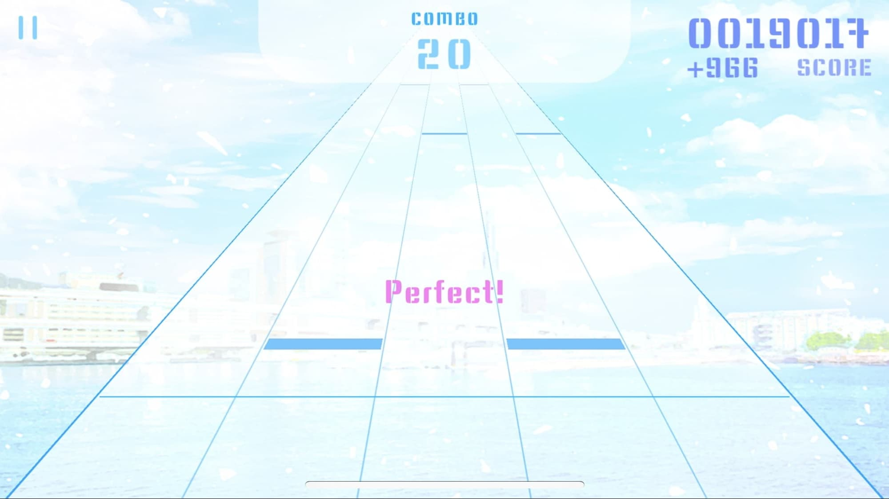
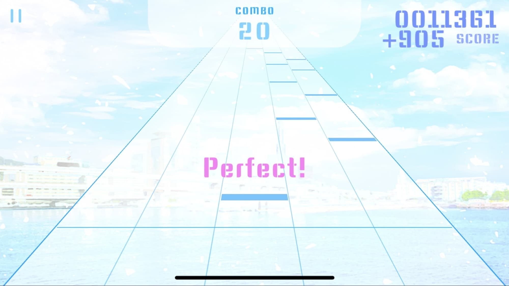
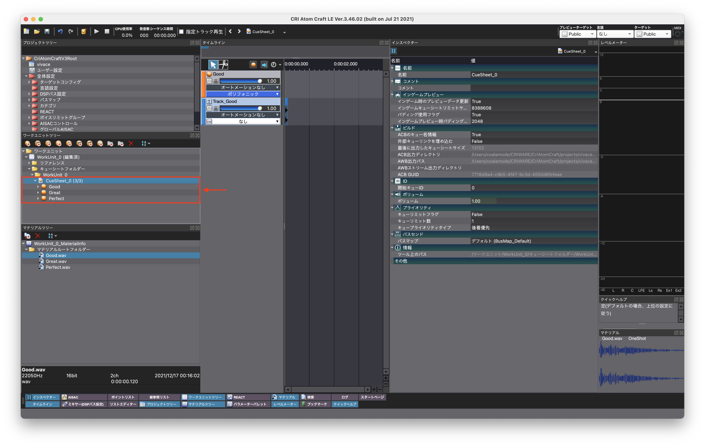
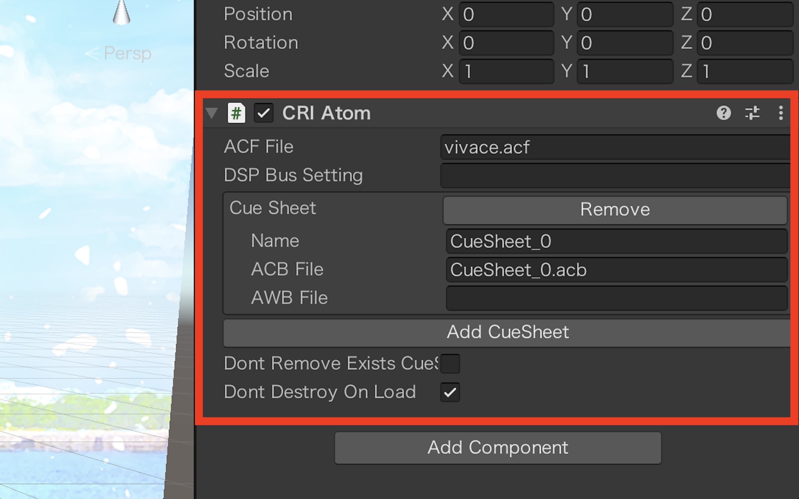
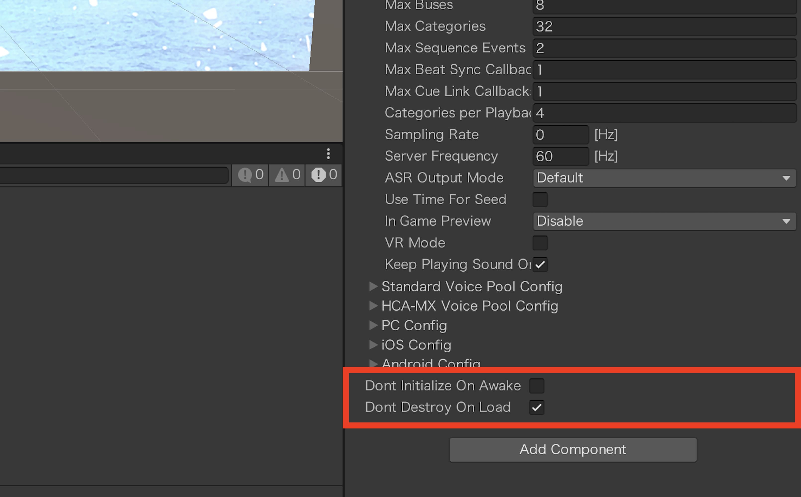
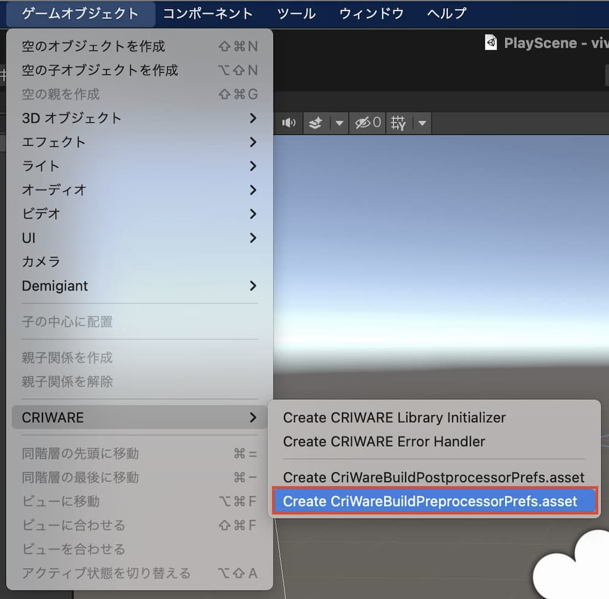
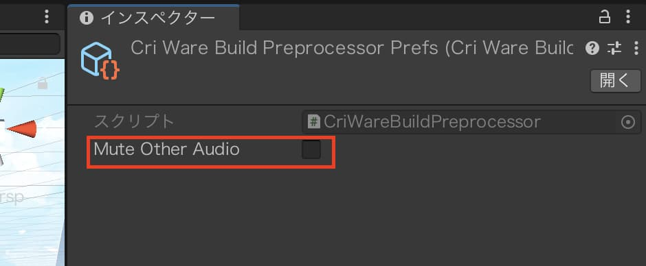

## ノーツタッチ時の遅延がなかなか改善できませんでした

改善前は、効果音はUnity標準のサウンドアセットを使用していました。この再生方式は、安定した音声を再生するために十分な量のデータをバッファに溜め込んでから出力しています。

これまでBufferingTimeを短くしたり、音声データの先頭余白をギリギリまでカットしたりすることで、体感上遅延が少なくなるように工夫してきましたが、ノーツが多く同時に効果音が再生される箇所では遅延が若干感じられました。

## プロセカで使われている SonicSYNC 技術の解説動画を発見しました

たまたまチャンネル登録していた CA.Developer チャンネルで、`「プロジェクトセカイ」の音声再生の仕組みとSonicSYNCで変わったこと | CA.Unity#3` という動画が、5日ほど前に投稿されました。

> **「プロジェクトセカイ」の音声再生の仕組みとSonicSYNCで変わったこと | CA.Unity#3**
> https://www.youtube.com/watch?v=7ql4CNBehes

SonicSYNC とは、「スマートフォンでの音声再生遅延を限りなくゼロにする機能」で、ハードウェアと同期して即座に音声信号を生成することにより、ソフトウェア処理による再生遅延を限りなくゼロにできる技術です。音声処理が短時間で終わるように細かく分割し、音が必要になった時にすぐに準備して鳴らすという工程を繰り返すことで、これまでのようにバッファーに溜めておく必要がないため遅延が改善されます。

## 個人が無償で使えるADX2 LEというミドルウェア

本来であれば企業向けである ADX2 が有償で提供されているのですが、学生や個人が無償で使うことができる ADX2 LE というものがあります。（コンテンツの売り上げが1,000万円以内であることなど、一定の条件はあります。）今回 ADX2 LE を導入して、ノーツタッチ時の効果音の遅延を改善していきたいと思います。

## 必要な音声ファイルを生成する

今回の ADX2 では、音声ファイルを以下のものに変換する必要があります。

| 形式 | 説明 |
| ---- | ---- |
| .acf | 環境設定やACBファイルから参照されるキューシート共通の情報を格納する |
| .acb | キュー情報、再生パラメータ、メモリ再生用波形データをキューシート単位でパッキング |
| .awb | ストリーム再生用波形データをキューシート単位でパッキング（ストリームにする場合のみ、今回は使用しない） |

これらのファイルを生成するために、「CRI Atom Craft」というソフトウェアを使用します。
> **CRI Atom Craft**
> https://game.criware.jp/learn/tutorial/atomcraft/

変換元の素材ファイルは以下のものが使用できます。

| | データ情報 |
| ---- | ---- |
| ファイル種類 | WAVファイル（.wav）または AIFFファイル（.aif） |
| チャンネル数 | 最大6チャンネル |
| 量子化ビット数 | 16ビット |

今回は1つのキューシートに、`Perfect` `Great` `Good` の3つのサウンドを登録します。
最後の書き出し時には、`Unity Assets出力` にチェックを忘れないようにしましょう。

書き出したファイルは、Unity の CRIWARE からインポートすることで、StreamingAssets フォルダに保存されます。

## ハマったところ
Unity 側で CRI Atom のスクリプトがありますので、読み込んだ`ACFファイル` `ACBファイル` を指定します。
ここで、`Don't Destroy On Load` のチェックをつけておきます。読み込み後に destroy してしまうと、Sceneを2回目に読み込んだ際（2曲目をプレイする際）にサウンド再生ができなくなります。

そして、`Don't Initialize On Awake` のチェックを外しておきます。

また、ビルドする際に **強制的にUnity 標準オーディオが無効化** されます。
Unity標準のオーディオが無効化されることで、アプリケーションのCPU負荷およびメモリ使用量を軽減できるそうです。
しかし今回は、プレイ音源は Assetbundle を使用しているため、Unity標準オーディオと共存させます。

`CriWareBuildPreprocessorPrefs.asset` という設定ファイルを書き出し、`Mute Other Audio` を解除します。

これでビルド時に、強制的にUnity標準オーディオが無効化されないようになります。

## 導入後の遅延の測定

計測した結果、ノーツをタッチしてから効果音が鳴るまで、約60~70ミリ秒まで遅延を減らすことができました。
CRIWAREの公式サイトでは、iOS・Android共に「画面をタップしてから音が出るまで」53ミリ秒程度と記載されていたので、vivace（製作中の音ゲー）のタッチ入力のアルゴリズムに改善方法があるということになります。
しかし、ノーツが多い時の効果音遅延が劇的に改善されているので、DEMON譜面をプレイされるガチプレイヤーさんたちには大きなアップデートになるのではないでしょうか。もう少しアルゴリズムを改修してからストアにリリースしようと思いますので、お楽しみに〜

## ダウンロードはこちら

さっきDBをみてみると、登録ユーザー数が299人になっていました！

これを見たあなた、ぜひ300番目のプレイヤーになってください

> **AppStore:**
> [https://bit.ly/vivace-app-ios](https://bit.ly/vivace-app-ios)
>
> **GooglePlayStore:**
> [https://bit.ly/vivace-app-android](https://bit.ly/vivace-app-android)