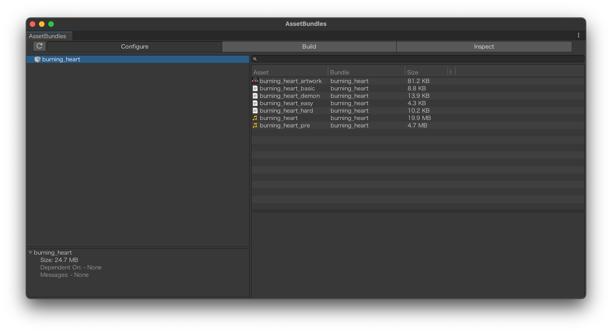
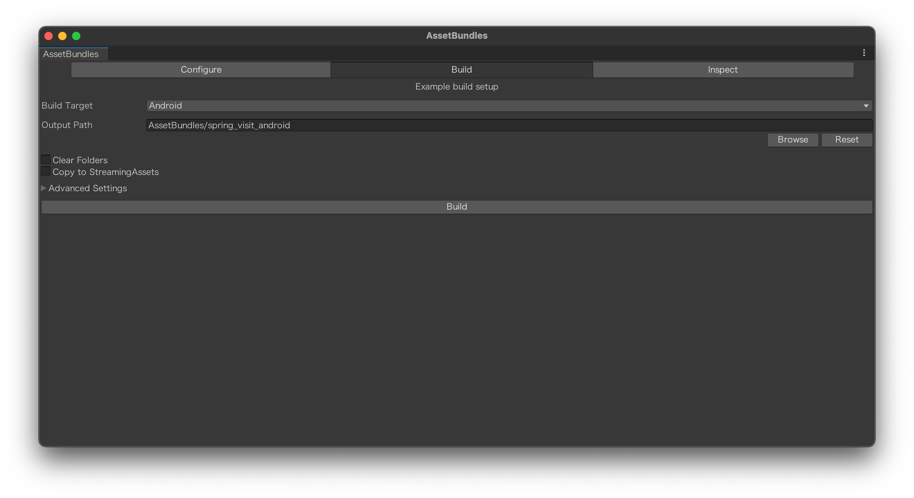
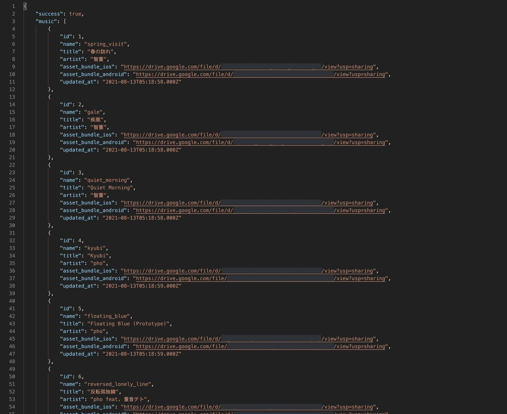
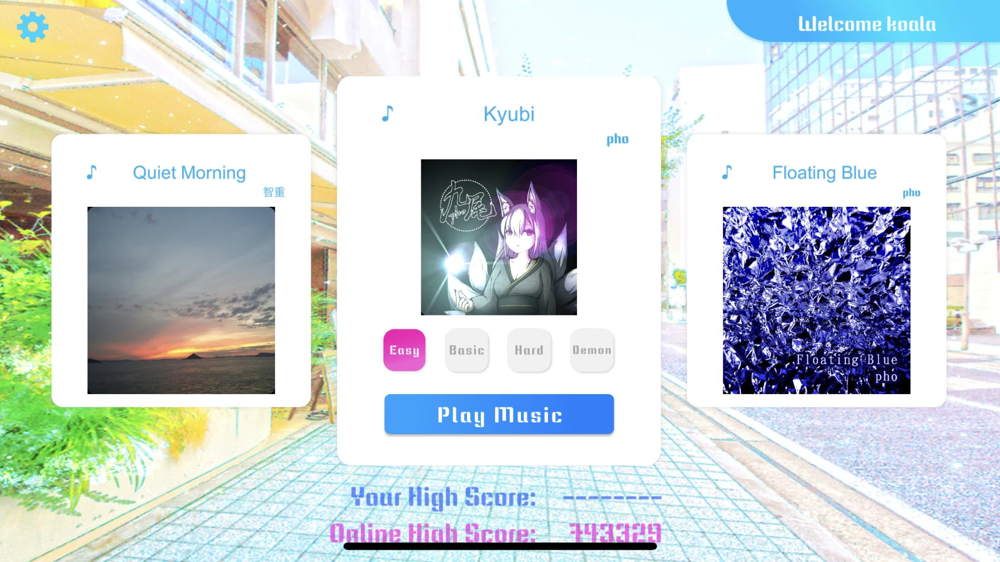
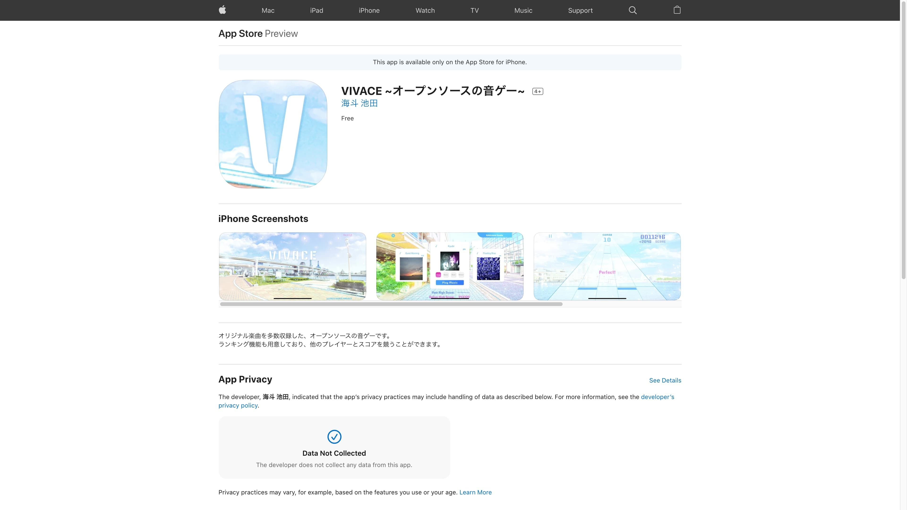
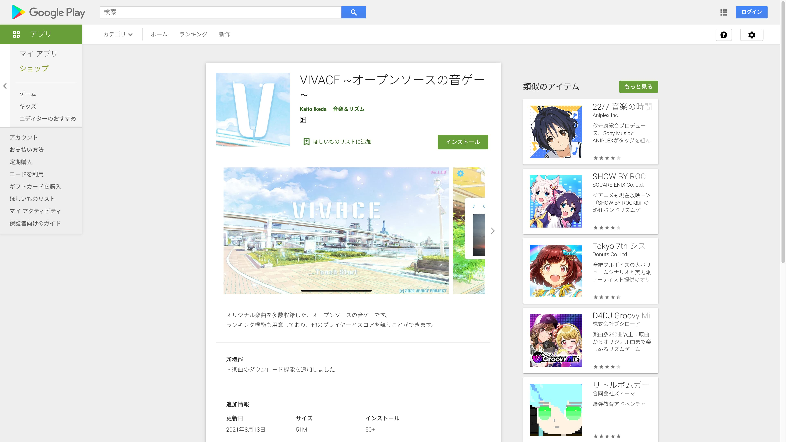

## これは１年前のお話...

学祭に向けて、昨年同級生と3人で[音ゲーを作った話](https://coalabo.net/p/vivace)は過去に記事にしたと思います。

当日の朝4時まで Discord をつないでコーディングをし、学祭ギリギリでビルドして、エラーがないことも確認できました。


## Discord の通話を切った後、悲劇は起こります

> 私: 「じゃぁもう4時半だし、PlayStore に APK ファイルをアップロードして、寝るか〜〜」
>
> カチッ
>
> カチッ
>
> （ドラッグの音）
>
> Google Play Store: 「**エラー:** APK ファイルのサイズを 100 MB まで小さくするか、APK 拡張ファイルを使用する必要があります。」
>
> 私: 「 ！！！！！！！！！」

**そうです、この音ゲーアプリ、楽曲ファイルが原因で軽く100MBを超えちゃってるんです。**

さすがに眠くて、Google Play Store でのリリースは諦めました。（当日は APK 配布）


## 今回は追加ダウンロード機能を実装して、アプリストアへのリリースまでやります！

大体の音ゲーって、アプリサイズ縮小のために、起動後にコンテンツのダウンロードを行いますよね。

今回はそれを、AssetBundle と用意している API サーバを用いて実装していきます。

AssetBundle とは、アプリのビルド時に行っている処理を事前に行っておく事により、実行時に外部からアセットがロードできるようにしたものです。
これを Web サーバなどに置いておくことで、ダウンロードしてリソースを使用できるようになります。


## AssetBundle の作成

今回は AssetBundleBrowser を使用します。これはプレリリース版ですので、使用は自己責任でお願いします。

> [**AssetBundleBrowser** (GitHub)](https://github.com/Unity-Technologies/AssetBundles-Browser)　https://github.com/Unity-Technologies/AssetBundles-Browser



使い方は簡単、このツールに AssetBundle にまとめたいものをドラッグします。
今回だと、音源とプレビュー用の音源、各難易度の譜面とアートワークをセットし、
Build タブに移動します。



AssetBundle は各プラットフォームごとに分かれています。
今回のリリースは、iOS と Android に絞ってますので、この2つを作成します。


## 配信するためのサーバを用意します

本来は用意してあるバックエンドサーバから、AssetBundle を DL できるようにするといいのですが、
Google Cloud Platform を使用しているため、あまりディスク容量を増やしたくありません。

ということで、Google Drive のいつもの作戦を使います！

本来 Google Drive で共有リンクを生成すると、

> **https\://drive.google.com/file/d/** hogehoge **/view?usp=sharing**

というリンクになるのですが、以下のようにリンクを変更すると、ファイルをダウンロードさせるヘッダーに変更できます。

> **https\://drive.google.com/uc?id=** hogehoge **&usp=sharing**

毎回リンクを手動で変更させるのは面倒なので、データベースには共有リンクで登録しておき、アプリ内でリンクを変換させるようにしておきます。

```cs
music.asset_bundle_ios.Replace("https://drive.google.com/file/d/", "https://drive.google.com/uc?id=")
                        .Replace("/view?usp=sharing", "&usp=sharing");
```

また、曲選択画面に表示される曲一覧は、DB と同期できるようにしてあります。
急遽任意の曲を非表示にするときや、楽曲を追加した時でもリアルタイム更新できるようになりました。
（セキュリティのため、通信には JWT での認証が必要です）




アプリ内画面では、APIのデータを取得しこのように表示されます。




運用・メンテナンスしていく上では、こういうリモートでの更新機能も大切ですね。


## Unity 内部のコード

調べてみると、`UnityWebRequest` には AssetBundle をダウンロードする専用の `UnityWebRequestAssetBundle` が用意されているようです。

また、一度DLした楽曲はキャッシュしておきたいので、第2引数に CachedAssetBundle を入れて呼び出すことで、2回目以降の起動でダウンロードを省略できます。

キャッシュされる条件ですが、CachedAssetBundle 以外にも `version (uint)` や `hash (Hash128)` を第2引数に入れてロードすることで、
同じくキャッシュが行われるそうです。（非推奨になりつつありますが、`WWW.LoadFromCacheOrDownload` を使ってキャッシュする場合は version の型は int に変わるそうなので注意）

ちなみに非推奨という点では、SendWebRequest の後のリクエスト処理も、`request.isNetworkError` ではなく、
`request.result`の値を、`UnityWebRequest.Result.Success`・`UnityWebRequest.Result.ConnectionError`・`UnityWebRequest.Result.ProtocolError`... といった用意されたクラスの enum の値で識別するのを推奨するようになりましたね。見やすくてとても気に入っています。（コード詳細↓）

```cs
private IEnumerator DownloadAssetBundle(MusicList music, string downloadUrl)
{
    var c = new CachedAssetBundle
    {
        name = music.name,
        hash = Hash128.Parse(music.name + music.version)
    };

    using var request = UnityWebRequestAssetBundle.GetAssetBundle(downloadUrl, c);
    yield return request.SendWebRequest();

    switch (request.result)
    {
        case UnityWebRequest.Result.Success:
            /* 略 */
            break;

        case UnityWebRequest.Result.ConnectionError:
        case UnityWebRequest.Result.ProtocolError:
        case UnityWebRequest.Result.DataProcessingError:
            /* 略 */
            break;

        case UnityWebRequest.Result.InProgress:
            break;

        default: throw new ArgumentOutOfRangeException();
    }
}
```

CachedAssetBundle を使用することで、URL から抽出されるファイル名と指定したバージョン番号を意識しなくて良くなり
（そもそも Google Drive のリンクなのでできないですが...）、
保存場所の衝突など AssetBundle でよく発生する問題をハッシュ値で回避することができます。

あとは対応するプラットフォーム毎にダウンロードURLを切り替え、
リソース使用部分を全て AssetBundle から読み込むように設定し直します。

今回のプロジェクトの場合、バックエンドのスコア登録機能も、データベースの楽曲テーブルと同期させる必要がありました。


## 無事ストアリリースできました！！





ストアリリース後、1日で60人の方が遊んでくれて、~~正直GCPの料金が上がらないか心配~~ **とても嬉しい** です。

ということで、是非こちらから遊んでみてくださいね ♪

今秋、楽曲追加も予定しています。

追記：リリース1週間で、ユーザ登録200人を超えました！！プレイしてくれた方、ありがとうございます。

> **AppStore:**
> [https://bit.ly/vivace-app-ios](https://bit.ly/vivace-app-ios)
>
> **GooglePlayStore:**
> [https://bit.ly/vivace-app-android](https://bit.ly/vivace-app-android)