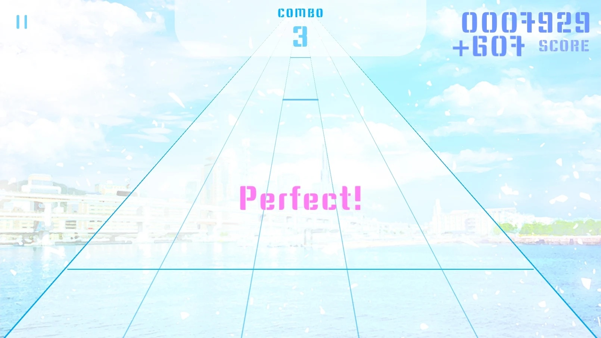
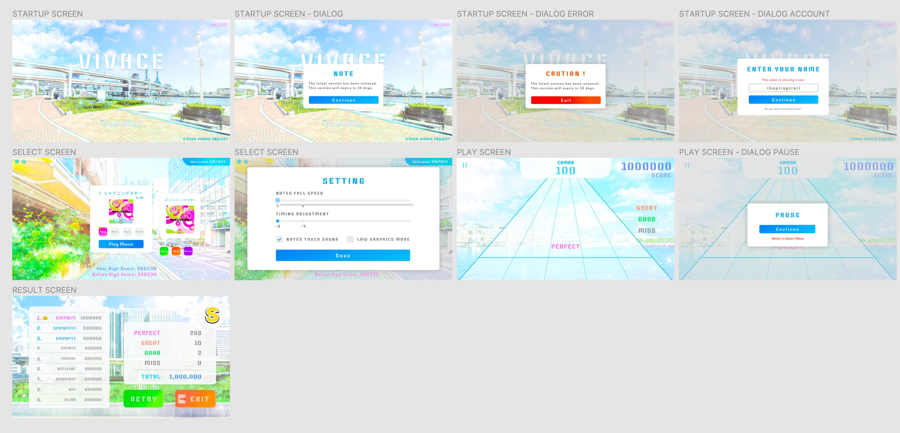
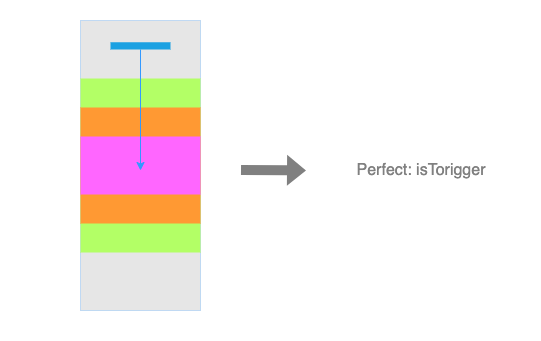
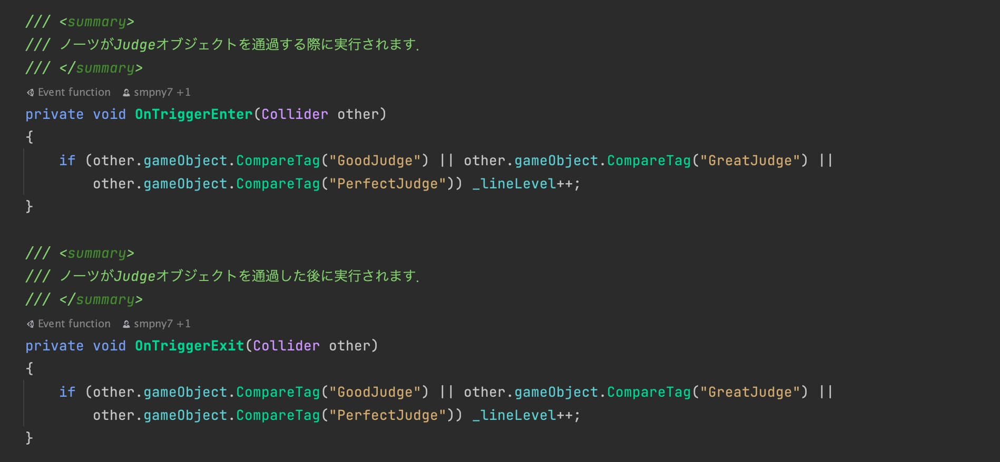
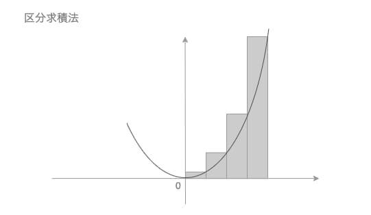
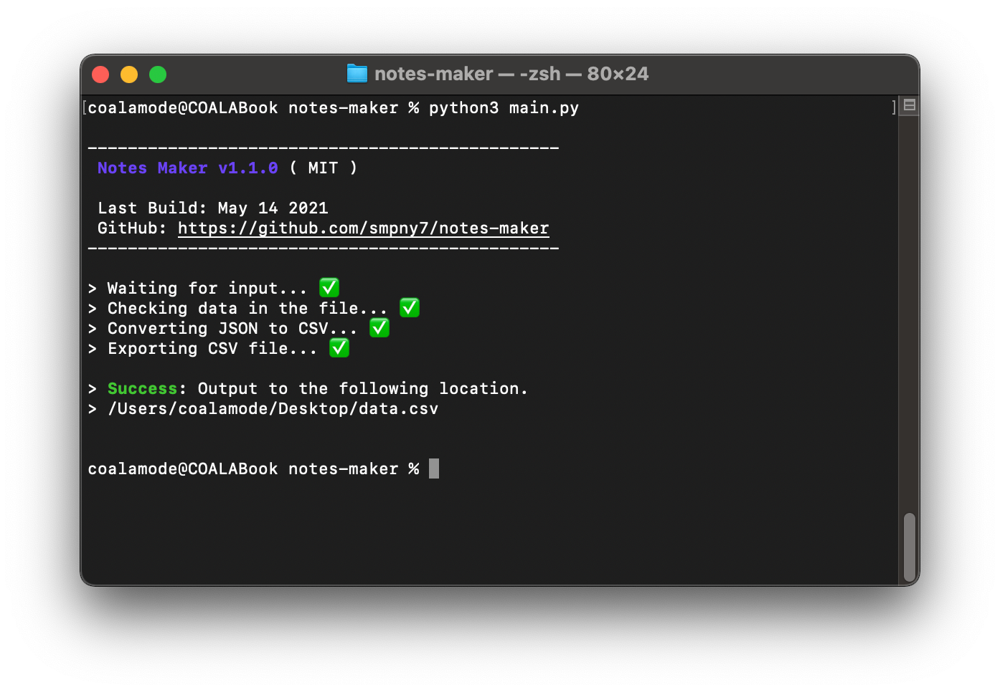
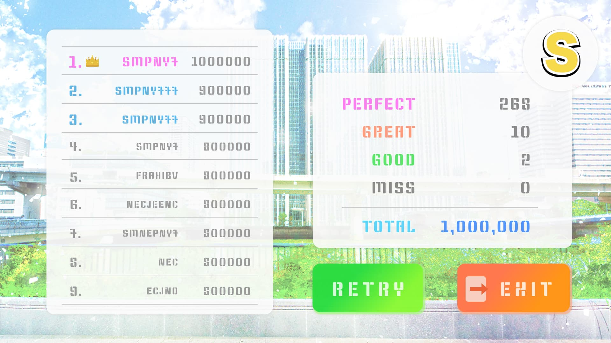

## 学祭で何か展示したい！

その当時、新しいジャンルのものに挑戦したい！とずっと考えており、Unity に挑戦することにしました。

同級生のエンジニア 3名で作ったのですが、制作物は 3人とも大好きな「音ゲー」にしました。

こんな感じの音ゲーを制作しました（ネタバレ）↓





## タイトル決定

まず初めに考えたのは、仕様でもデザインでもなくタイトルでした。

タイトルは、「VIVACE」（ヴィヴァーチェ）です！
速度記号で、「活発に」という意味があるそうです。


## デザイン作成！

デザインを作成するのが一番好きかもしれません（おい）

最近はデザインを作成するだけで満足感を得ることができるようになりました。




## とりあえず、最低限遊べるコードを実装します

本来であればタッチで遊べる仕様ですが、とりあえずキーボードでノーツを叩けるようにします。

中央から順に、`Perfect`・`Great`・`Good` の3つの `Box Collider` を設置し、
ノーツ落下時の `onTriggerEnter` と `onTriggerExit` の2つで判定を検知します。





スコアに関しては、共同開発したメンバーが区分求積法での加算を実装してくれました（天才）

ん... 区分求積法ってなんだっけ？

これです！高校数学で習いましたね！（私は gg った）




## ノーツの読み込み仕様を決定

とりあえず、CSV形式（カンマ区切り）で譜面を制作することにしました！

こんな感じ ↓

```shell
1.6901408450704225,1
1.6901408450704225,3
2.007042253521127,2
2.323943661971831,3
2.535211267605634,2
2.535211267605634,4
2.9577464788732395,2
2.9577464788732395,4
3.591549295774648,3
3.8028169014084505,2
4.014084507042254,1
4.225352112676056,0
...
```

ノーツタッチの時刻と、それに対応するレーン（0〜4）番号を保存しています。

また、これを生成するツールも Python で実装しました！



詳しくはこちら ↓
> [**notes-maker（GitHub）**](https://github.com/smpny7/notes-maker) https://github.com/smpny7/notes-maker


## さて、次は楽しい楽しいバックエンド

VIVACE には、「ランキングボード」という機能があり、各曲上位スコア10名の名前とスコアがクリア時に掲載されます。



鬼譜面ばかりなので、スコアが80万点にすら乗らない曲ばかりですが...（もはや人間業ではありません）

まぁ1~10位が全部100万点とかにならないので、いい感じにランキングボードが機能しているなという感じです。

少し脱線しましたが、プレイヤーのクリア履歴は全部サーバーのDBに保管されており、
ユーザーの認証やデータの別端末への引き継ぎ、スコアの格納などはバックエンドのAPIで行っています。

とりあえず、何で作ろう...？

と熟考し、最終的に私の大好きな Express で作ることにしました。
具体的には`Node.js` + `Typescript` + `Express` で作成しています。

サーバーは GCP の無料枠で、Docker 環境で今もなお動かしています。

詳しくはこちら ↓
> [**vivace-api（GitHub）**](https://github.com/smpny7/vivace-api) https://github.com/smpny7/vivace-api


## 共同作業の始まりだ！

ここからプロジェクトを GitHub Organizations のリポジトリに移植し、
共同開発がしやすいようにセットアップしました。（[こちら](https://github.com/vivace-app)）

コーディングは基本メンバーの3人で行い、譜面の作成は、基本他の部員に手伝ってもらいました。（結果 → 鬼譜面）

あまりもう覚えてないですが、曲選択機能やノーツ落下速度・タイミング調整機能、
プレイ時のエフェクトやサウンドなどを2ヶ月くらいかけて極めていきました。

学祭当日の朝4:00まで、みんなで徹夜でバグ修正していたのは秘密です（楽しかった）


## 学祭終了後

3人で話し合い、このソースコードは、バックエンド・譜面生成ツールも含めオープンソース化しようということになりました。

海外の人がフォークしてくれてたのには少し驚きましたが、自分達でも楽曲DL機能・GooglePlayログイン機能など、
少しずつですが、さまざまなアップデートを加えていってます。

鬼譜面ですが、史上最強の音ゲーだと思います！


## 最後に

この音ゲーを制作した経緯として、もう1つの理由があります。

サークルの後輩たち（DTM してる人が多いです。）が、コミケに向けて曲をたくさん作っていました。
しかし、コロナ化の影響で中止となり、アウトプットする場がなくなってしまったこともあり、
同級生3人でその曲を使った音ゲーを作り、1つの製作物にしようということになりました。

エンジニアの3人以外にも、楽曲製作班、譜面製作班など、コロナ禍の学祭で、
ここまで団結してオンラインで出し物を準備することができるとは思わなかったので、
忘れられない貴重な体験になりました。

制作に協力していただいた皆様、本当にありがとうございました。
